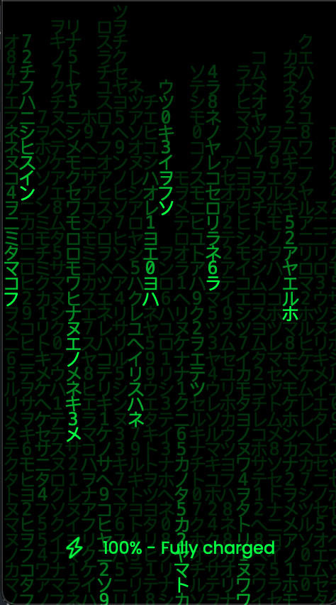
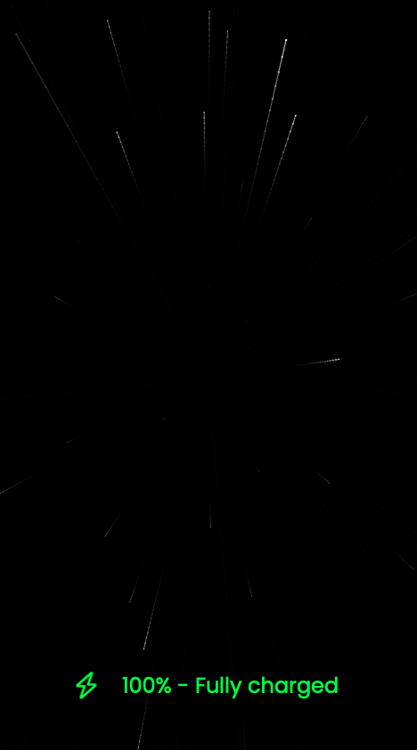
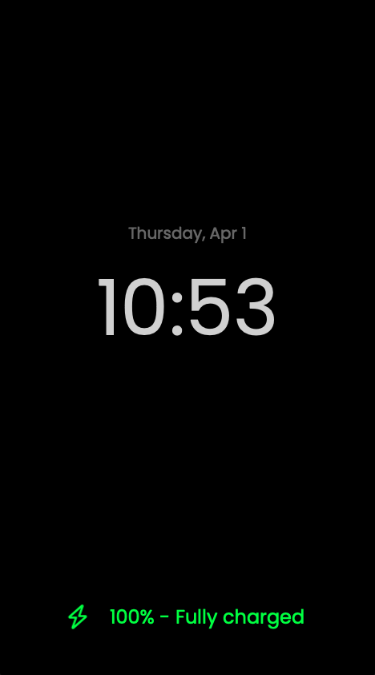
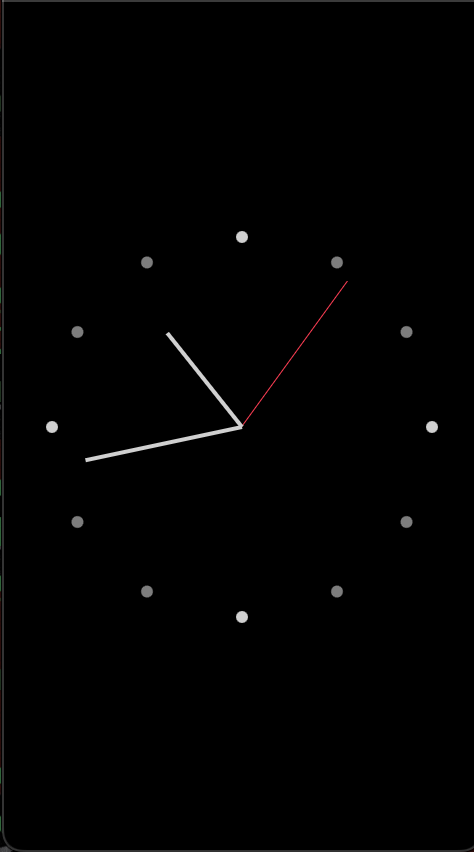
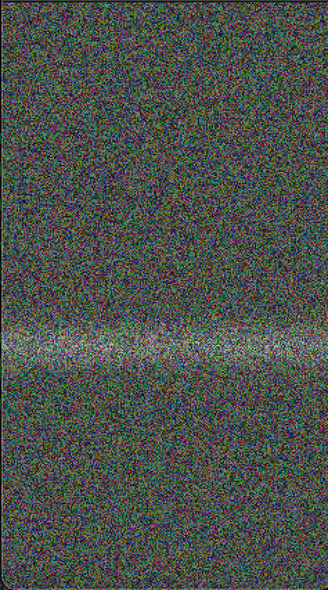

# Madalone's Defolded Circle 3 — Custom Screensaver Firmware

Custom firmware fork of [`unfoldedcircle/remote-ui`](https://github.com/unfoldedcircle/remote-ui) for the **Unfolded Circle Remote 3**, replacing the stock analog-clock charging screen with a GPU-accelerated screensaver system.

Five themes, nine screen-off animation styles, full DPAD/touch interaction, zero Home Assistant dependency, clean fall-back to stock UI on install failure.

[**▶ Watch the demo on YouTube Shorts**](https://youtube.com/shorts/jFoOmoNNWwU) — 30-second tour of Matrix rain in action on a UC3.

| Matrix Rain | Starfield | Minimal | Analog | TV Static |
|:-----------:|:---------:|:-------:|:------:|:---------:|
|  |  |  |  |  |

---

## Features

**Themes (v1.2.2):**
- **Matrix rain** — 3-layer depth with per-cell residual glow, 108 tunable properties, 6 color modes (green / blue / red / amber / white / purple + rainbow / rainbow-gradient / neon), 4 charsets (ASCII / binary / digits / katakana), full glitch engine (flash, stutter, reverse, direction trails, chaos bursts), coprime-gravity auto-rotation with DPAD/touch direction control, message overlay with pulse/flash effects. **⚠ 108 tunables is enough rope to make it look stunning, subtle, chaotic, or downright unreadable.** Every combination is legitimate and intended — the defaults are a conservative starting point, but every slider, toggle, and colour picker is exposed because the point of the mod is to let you push it wherever you want.
- **Starfield** — warp-speed star tunnel with depth, trail length, color gradients (rainbow / neon)
- **Minimal** — large digital clock + locale-aware date, font + size + color configurable, optional 24h mode
- **Analog** — scaled-up analog clock with gradient hands + shutoff animation
- **TV Static** — CRT noise + scanlines + chroma + channel-flash bursts with GLSL shader

**Overlays (on every theme):**
- Clock (position: top / center / bottom, 24h toggle, color, font, docked-only mode)
- Battery level (icon + percent with 5-tier color coding, size slider, "Fully charged" translated)

**Screen-off animations:**
A shared animation system plays a short shutdown effect right before the hardware blanks the display. Two-tier architecture: a *Tier 1* shared overlay (8 styles, works on any theme) plus an optional *Tier 2* theme-native protocol (themes can opt in with their own tightly-integrated effect). Event-driven via the core's `Normal → Idle` transition with self-calibrating dim-phase measurement — no baseline drift, no guessing.
- **Fade** — monotonic black ramp. Clean dim-to-nothing, safest baseline.
- **Flash** — brief white full-screen pulse, hard cut to black. Classic "TV zap off".
- **Iris (vignette)** — circular black mask closes from edges to centre. Camera-shutter feel.
- **Wipe** — solid black rectangle sweeps top-to-bottom like an old film projector.
- **Wave** — soft cyan gradient wave travels downward, dimming everything behind it.
- **Genie** — the live theme shrinks and slides toward the bottom of the screen via an inverse-scale UV transform. macOS Genie energy without the curved ribbon.
- **Pixels** — theme progressively pixelates into bigger blocks (0.5% → 8% of screen width), then fades to black.
- **Dissolve** — theme blends into per-pixel white noise, progressively shifts to pure noise, then fades to black.
- **TV Static (theme-native, CRT collapse)** — only when the TV Static theme is active. Snow and scanlines collapse vertically into a bright horizontal line, the line shrinks horizontally to a dot, the dot fades to black. 800 ms collapse + 500 ms black hold, synchronized with the real hardware display-off.

Controls live under `Settings → Power saving → Screen off animations`: master on/off, "Fire when undocked" toggle (plays on battery idle-timeout too), and the style picker.

**Interactive (Matrix theme):**
- DPAD 8-way direction with smooth gravity-lerp (no respawn on direction change)
- Touch zones: 4-corner direction, double-tap to close, long-press to slow
- Tap effects: burst, flash, scramble, spawn, square burst, ripple, wipe (all togglable, optional randomize)

---

## Install

> ### ⚠ Read this before installing on a UC3 that isn't yours
>
> **Tested only on the maintainer's UC Remote 3 running firmware 1.9.x.** Other firmware versions and hardware revisions are **not** validated. If the custom UI fails to start on your device, the stock Qt UI is always available as a fallback — run:
>
> ```bash
> curl -X PUT "http://${UC3_HOST}/api/system/install/ui?enable=false" \
>     -u "web-configurator:${UC3_PIN}"
> ```
>
> This is a fully supported UC3 API and cannot brick the device. **Save it before you install.** Installing voids warranty (`?void_warranty=yes` is mandatory); the revert above restores stock and returns warranty state to UC. For extra safety, run [`scripts/deploy-canary.sh`](scripts/deploy-canary.sh) — it auto-reverts on health-check failure.

See **[SCREENSAVER-README.md](SCREENSAVER-README.md)** for the full install flow including device setup, PIN, and revert procedure.

Quick version for anyone who's already set up:

```bash
# 1. Download the latest release tarball + checksum
curl -L -O https://github.com/mmadalone/Madalones-Defolded-Circle-3/releases/download/v1.2.2/remote-ui-v1.2.2-UCR2-static.tar.gz
curl -L -O https://github.com/mmadalone/Madalones-Defolded-Circle-3/releases/download/v1.2.2/remote-ui.hash

# 2. Verify integrity (SHA256 + GPG if signed — see docs/RELEASE_SIGNING.md)
./scripts/verify-release.sh remote-ui-v1.2.2-UCR2-static.tar.gz remote-ui.hash

# 3. Install on your device (replace with your UC3 host and web-configurator PIN)
curl --location "http://${UC3_HOST}/api/system/install/ui?void_warranty=yes" \
    --form "file=@remote-ui-v1.2.2-UCR2-static.tar.gz" \
    -u "web-configurator:${UC3_PIN}"
```

The device reboots the UI process (~10 s). If anything breaks, revert to stock:

```bash
curl -X PUT "http://${UC3_HOST}/api/system/install/ui?enable=false" \
    -u "web-configurator:${UC3_PIN}"
```

**⚠ This voids your warranty.** The custom install endpoint requires the `?void_warranty=yes` query string. Upstream UC will not support the device while custom firmware is active.

For safer rehearsals, the repo ships a mock UC3 HTTP endpoint at [`scripts/mock-uc3-api.py`](scripts/mock-uc3-api.py) so you can exercise [`scripts/deploy-canary.sh`](scripts/deploy-canary.sh) locally before pointing it at a real device.

---

## Build from source

Requirements:
- Docker (for ARM64 cross-compile via UC's static Qt toolchain)
- Qt 5.15.2+ on the host for local desktop builds (optional — only needed for the macOS / Linux simulator)

```bash
# Clone
git clone https://github.com/mmadalone/Madalones-Defolded-Circle-3.git
cd Madalones-Defolded-Circle-3
git submodule update --init --recursive

# Cross-compile for UC3 (ARM64)
docker run --rm --user=$(id -u):$(id -g) \
    -v "$(pwd)":/sources \
    unfoldedcircle/r2-toolchain-qt-5.15.8-static:latest

# Output: binaries/linux-arm64/release/remote-ui
```

Desktop-side build (requires Qt 5.15 Creator + UC's Core Simulator):

```bash
qmake && make -j$(sysctl -n hw.ncpu)
UC_MODEL=DEV ./binaries/osx-*/release/Remote\ UI
```

See [`BUILD.md`](BUILD.md) for the full dev flow including `.env.local` setup for deploy credentials, the Docker VNC screensaver preview (`test/matrixrain_preview/`), and on-device `logdy` log viewer.

---

## Architecture

| Layer | Where | What |
|---|---|---|
| **C++ renderers** (`src/ui/`) | `matrixrain.cpp` (QQuickItem + QSGGeometryNode + texture atlas), `rainsimulation.cpp` (simulation logic), `glyphatlas.cpp` (GPU glyph atlas) | GPU pipeline, simulation tick, per-frame vertex emission on the Qt scene-graph render thread |
| **Config bridge** (`src/ui/`) | `screensaverconfig.cpp` + `screensaverconfig_macros.h` | 108 Q_PROPERTY-backed settings via `SCRN_BOOL/INT/STRING` macros, QSettings-backed, survives popup destruction on undock |
| **QML themes** (`src/qml/components/themes/`) | `MatrixTheme.qml`, `StarfieldTheme.qml`, `MinimalTheme.qml`, `AnalogTheme.qml`, `TvStaticTheme.qml` | Thin QML wrappers implementing a common theme-native screen-off protocol (see `BaseTheme.qml` for the contract) |
| **Settings UI** (`src/qml/settings/settings/chargingscreen/`) | 13 sub-pages | DPAD-navigable theme picker + per-theme config sliders/toggles |
| **CI** (`.github/workflows/`) | `build.yml` (cross-compile + release + GPG signing), `tidy.yml` (clang-tidy baseline), `test.yml` (QtTest suite + 5 theme tests), `code_guidelines.yml` (cpplint) | Every push is built, lint-checked, and release-signed (when tagged) |

See [`STYLE_GUIDE.md`](STYLE_GUIDE.md) for the full architectural conventions and [`docs/CUSTOM_FILES.md`](docs/CUSTOM_FILES.md) for the custom-vs-upstream file manifest.

---

## Release verification

All tagged releases (`v1.2.2+`) ship with a SHA256 hash file; releases built after the maintainer configures the GPG signing secret will also ship with detached `.asc` signatures.

```bash
# Import the project release key (one-time)
gpg --import docs/release-pubkey.asc

# Verify a download
./scripts/verify-release.sh \
    remote-ui-v1.2.2-UCR2-static.tar.gz \
    remote-ui.hash \
    remote-ui-v1.2.2-UCR2-static.tar.gz.asc
```

Key details + rotation procedure: [`docs/RELEASE_SIGNING.md`](docs/RELEASE_SIGNING.md).

---

## Upstream relationship

This is a **fork** of [`unfoldedcircle/remote-ui`](https://github.com/unfoldedcircle/remote-ui), tracked via the `upstream` git remote. All custom work lives on `main`; upstream commits are merged manually per the playbook in [`docs/UPSTREAM_MERGE.md`](docs/UPSTREAM_MERGE.md). Current fork base: **`v0.71.1`**.

Fork state is re-checked before each release: `git fetch upstream && git merge --no-commit upstream/main` on a throwaway branch. Latest re-check (2026-04-13): **0 behind, 91 ahead, strict superset of `upstream/main@0586d45`, zero conflicts**. No upstream commits are missing from our tree, no signal/property renames to worry about.

If you're looking for the stock UC Remote 3 firmware source, go to the upstream repo. This fork is specifically for running the custom screensaver on a UC3.

---

## How this was built

> *"Every line of code in this project was generated by **Claude** (Anthropic). I'm the architect who can't hold a hammer — I know what I want the building to look like, I can read blueprints, I can tell you when something's wrong, but I'm not the one pouring the concrete."*

This fork was **vibecoded** — designed, implemented, audited, and iterated entirely through conversation with [Claude Code](https://claude.ai/claude-code) (Anthropic's CLI agent). Every C++ renderer, GPU shader, QML component, settings sub-page, test file, CI workflow, and line of documentation — including this README — was produced through the same iterative loop:

1. **Describe intent** in natural language ("add a hidden message system that writes single chars into rain streams").
2. **Generate** the implementation (usually spanning C++ renderer + config bridge + QML wrapper + settings UI + qrc registration + unit tests, in a single coherent change).
3. **Rebuild** via the Docker ARM64 toolchain (`unfoldedcircle/r2-toolchain-qt-5.15.8-static`) and/or the Docker VNC screensaver preview (`test/matrixrain_preview/`) for visual verification against the actual Qt scene graph.
4. **Deploy** to a real UC Remote 3 via the stock install API (`/api/system/install/ui?void_warranty=yes`), verify the feature docked and on battery, verify no regressions in adjacent behavior (dock/undock cycles, screen-off animations, wake paths, thermal).
5. **Refine** until everything holds, then commit with a conventional-commits message that explains the *why*, not just the *what*.

No line was copy-pasted from a tutorial, Stack Overflow answer, or LLM playground. Every fix was validated on actual hardware before shipping.

### Human-reviewed documentation

Every user-facing document in this repo — this README, [`SCREENSAVER-README.md`](SCREENSAVER-README.md), [`BUILD.md`](BUILD.md), install instructions, release notes, upstream merge playbook, release signing procedure — is **human-reviewed and corrected** before it ships. The AI writes the first draft; the maintainer proofs every claim, verifies every screenshot reference, tests every curl command against the actual device, and rewrites anything that reads as hallucinated, out-of-date, or vague. If you spot a factual error in the docs, it's a bug — please open an issue.

### Thorough audits

The codebase has been through a full industry-standard audit ("brutally honest, no glazing") that graded it at B−/C+ on first review and then took it to a true **A grade** via seven sequenced batches — documented end-to-end in the plan file and in this repo:

- **Batch 0** — 4 user-reported screensaver bug fixes (close-on-wake-undock, Matrix/Starfield wake-black, idle-screensaver-off, display-off gap) + a thermal regression fix (sim pause during `displayOff`) + a DPAD direction respawn fix. Shipped as **v1.2.2**.
- **Batch A** — version sync CI gate, credentials scrubbed from every tracked doc, 60 MB of build-artifact git debt purged, `CRITICAL` landmine comments on the Qt 5.15 qmlcachegen binding race in AnalogTheme.
- **Batch B** — strict warning flags enabled project-wide (`-Wall -Wextra -Werror=format -Wold-style-cast -Wfloat-equal -Woverloaded-virtual -Wshadow`) with the full cascade fixed in every custom `src/ui/*` file. No pragma suppressions — root causes only.
- **Batch C** — `.githooks/pre-commit` running `cpplint.sh` + `clang-format --dry-run -Werror`; `lupdate` i18n baseline populated; [`docs/UPSTREAM_MERGE.md`](docs/UPSTREAM_MERGE.md) playbook; CHANGELOG sync gate in CI on tagged commits.
- **Batch D** — `clang-tidy` in CI via `.github/workflows/tidy.yml` with a starter ruleset (`modernize-*`, `bugprone-*`, `cert-*`, `performance-*`), tolerant baseline mode, per-file `NOLINT` comments with reasons for any intentional upstream-compat cases.
- **Batch E** — dead `CFG_*` macro family deleted, `SCRN_*` documented as canonical in [`STYLE_GUIDE.md`](STYLE_GUIDE.md) §6.6; four new QML theme lifecycle tests covering Starfield, Minimal, Analog, and TV Static beyond the existing Matrix suite.
- **Batch F** — GPG release signing pipeline ([`docs/RELEASE_SIGNING.md`](docs/RELEASE_SIGNING.md), [`scripts/verify-release.sh`](scripts/verify-release.sh)); canary deploy with auto-revert on health-check failure ([`scripts/deploy-canary.sh`](scripts/deploy-canary.sh)) and a local mock UC3 endpoint ([`scripts/mock-uc3-api.py`](scripts/mock-uc3-api.py)) so the canary path can be rehearsed without a spare device.
- **Batch G** — upstream merge rehearsal under the new playbook (result: fork is a strict superset, zero conflicts); [`docs/A11Y_AUDIT.md`](docs/A11Y_AUDIT.md) walkthrough; real translations populated for two non-English locales; CycloneDX [`sbom.cdx.json`](sbom.cdx.json) regenerated in CI.

### Testing discipline

- **~280 automated tests** — ~84 C++ unit tests (`test/matrixrain/`) + ~195 QML functional tests (`test/qml/`, `test/integration/`) covering Matrix/Starfield/Minimal/Analog/TvStatic lifecycles, settings bindings, visibility rules, DPAD navigation, config defaults, and the enter-state machine.
- **Four CI workflows** green on every push — `build.yml` (ARM64 cross-compile + release + GPG signing), `test.yml` (the full QtTest suite), `tidy.yml` (clang-tidy baseline), `code_guidelines.yml` (cpplint).
- **On-device verification for every Batch 0 bug fix** — 5 dock→idle→Low_power→wake cycles per theme, 10-cycle rapid churn test, 10-minute sustained dock for thermal, docked AND undocked paths for the wake-black fix.
- **Visual Docker VNC preview** — renders the actual `QSGGeometryNode` scene graph via Mesa software OpenGL in a disposable container, for when the macOS native build can't exercise the code path (Qt 5.15 OpenGL 2.1 limitation).
- **Settings round-trip verified** — every screensaver slider/toggle persists across the full Popup destroy/recreate cycle that happens on undock, because `ScreensaverConfig` is a QSettings-backed C++ singleton and not a Popup property.

### Safety posture

Because the device is a piece of hardware that belongs to someone, every change is built with the revert path as the first-class backstop:

- **Stock UC firmware is never modified.** The custom install only replaces the Qt `remote-ui` process. Stock boot / integration layer / entity controller / core API are untouched.
- **Revert is one curl command** (`/api/system/install/ui?enable=false`), a fully supported UC3 API. The install section of this README shows it before the install command, not after.
- **Canary deploy with auto-revert** is available via [`scripts/deploy-canary.sh`](scripts/deploy-canary.sh) for anyone who wants the extra safety net on first install.
- **Upstream divergence logged** in [`docs/UPSTREAM_MERGE.md`](docs/UPSTREAM_MERGE.md) before every release — no silent drift from the upstream baseline.
- **Warranty state is explicit** — the `?void_warranty=yes` install flag is called out, the revert flips it back.

---

## Contributing

[`CONTRIBUTING.md`](CONTRIBUTING.md) covers the workflow, code style (`cpplint.sh` + `.clang-format`), the local pre-commit hook (`.githooks/pre-commit`), and the PR process.

Custom modifications should follow the mod pattern documented in [`STYLE_GUIDE.md`](STYLE_GUIDE.md) §1 (anatomy: C++ renderer + `SCRN_*` config bridge + QML wrapper + settings sub-page + qrc registration).

---

## Version history

See [`SCREENSAVER-README.md`](SCREENSAVER-README.md) for the full release log and [`CHANGELOG.md`](CHANGELOG.md) for upstream UC changes.

**v1.2.2** (2026-04-13) — 5 screensaver bug fixes, thermal sim-pause, DPAD respawn fix, strict warning flags, clang-tidy CI, i18n baseline, macro cleanup, release signing + canary deploy scripts, upstream merge rehearsal, SBOM, a11y audit checklist.

**v1.2.1** — drop `displayOff` gate from matrix running binding (fixes wake-black race).
**v1.2.0** — runtime slider fix, tap master toggle.
**Earlier** — theme selector, GradientText, Analog theme, TV Static theme, screen-off animation system.

---

## License

**GPL-3.0-or-later** — see [`LICENSE`](LICENSE). Custom firmware modifications are under the same license as the upstream project. Third-party dependencies listed in [`sbom.cdx.json`](sbom.cdx.json) and [`licenses/remote-ui_licenses.md`](licenses/remote-ui_licenses.md).

---

## Not affiliated with Unfolded Circle

This is an independent community mod. Unfolded Circle does not endorse or support installs of this firmware. For the official product, see [unfoldedcircle.com](https://unfoldedcircle.com).
