# Custom Screensaver for Unfolded Circle Remote 3

A fully configurable screensaver system for the UC Remote 3. **Five themes** — GPU-accelerated Matrix rain, Starfield warp, Minimal digital clock, Analog clock, and TV Static — all controllable from the remote's Settings menu, DPAD, touchbar, and touch gestures. Plus a shared **screen-off animation system** that plays a configurable shutdown effect right before the display blanks.

## Demo

[](https://youtube.com/shorts/jFoOmoNNWwU)

## Screenshots

### Themes

| Matrix Rain | Starfield | Minimal | Analog | TV Static |
|:-----------:|:---------:|:-------:|:------:|:---------:|
|  |  |  |  |  |

### Screen-off animations

Textual descriptions instead of captures, since each style is a short in-motion effect that doesn't photograph well as a single frame. The settings page for picking one of them:

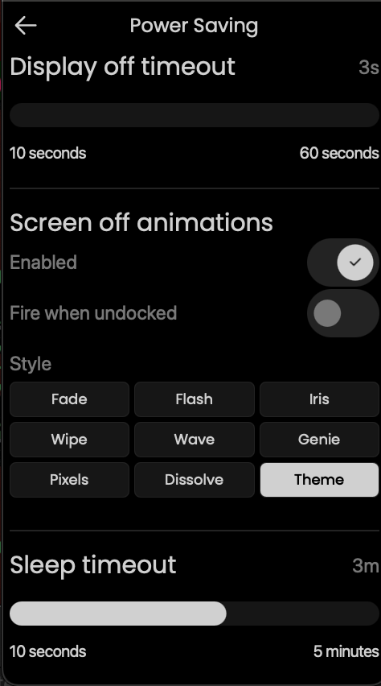

- **Fade** — monotonic black ramp. Clean dim-to-nothing, no character. Safe baseline for any theme.
- **Flash** — brief white full-screen pulse, then hard cut to black. Classic "TV zap off".
- **Iris (vignette)** — circular black mask closes from the edges to the centre, soft smoothstep edge. Camera-shutter / old-cartoon feel.
- **Wipe** — solid black rectangle sweeps top-to-bottom, like an old film projector finishing a reel.
- **Wave** — soft cyan gradient wave travels downward, dimming everything behind it. The most "peaceful" of the set.
- **Genie** — the live theme shrinks and slides toward the bottom of the screen via an inverse-scale UV transform. Uniform shrink, not a fluid mesh warp (Qt 5.15 is fragment-shader-only). Feels like macOS Genie without the curved ribbon.
- **Pixels** — the live theme progressively pixelates into bigger and bigger blocks (0.5% → 8% of screen width), then the pixelated output fades to black. Looks like the image is being destroyed bit by bit.
- **Dissolve** — the live theme blends into per-pixel white noise, progressively shifting to pure noise, then the noise fades to black. Film-dissolve energy.
- **TV Static (theme-native, CRT collapse)** — only active when the TV Static theme is on. Snow and scanlines collapse vertically into a bright horizontal line, the line shrinks horizontally to a single dot, the dot fades to black. 800 ms collapse + 500 ms black hold, synchronized with the real hardware display-off.

### Settings — Entry point

After installation, the stock `Settings` page gains a new **Screensaver** entry (stock UC firmware doesn't have this row — it's the sole visible footprint of this mod on the UC UI). Everything below lives behind that entry.

| Settings menu |
|:-------------:|
| 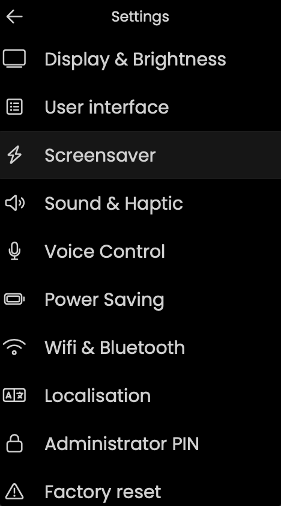 |

### Settings — Common toggles (shared across all themes)

Clock and battery overlay controls — show/hide, font, color, size, charging-only visibility — apply to every theme. General behavior toggles (double-tap to close, close on wake, idle screensaver + timeout, DPAD/touch interactivity for Matrix) are also visible on every theme's `-settings-01` capture below.

| Common toggles |
|:--------------:|
| 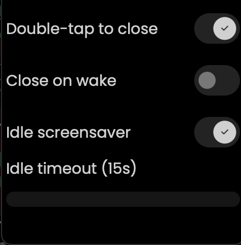 |

### Settings — Matrix

| Theme & Overlays | Appearance | Direction & Effects |
|:----------------:|:----------:|:-------------------:|
| 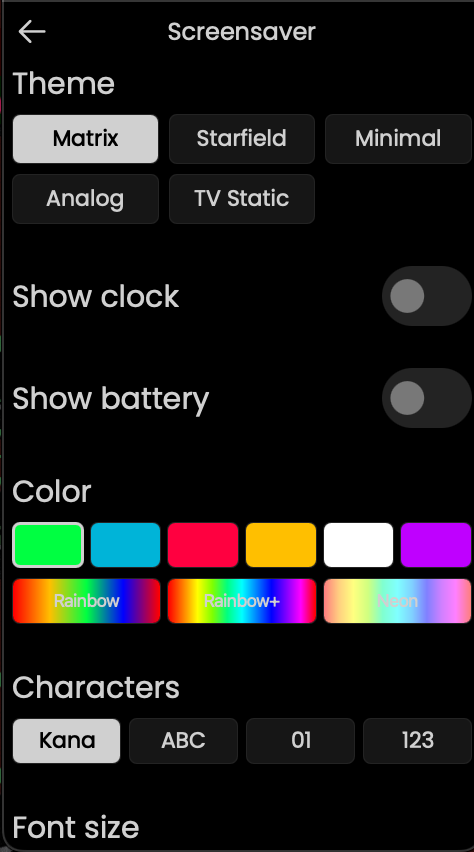 | 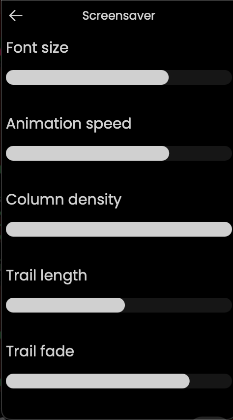 | 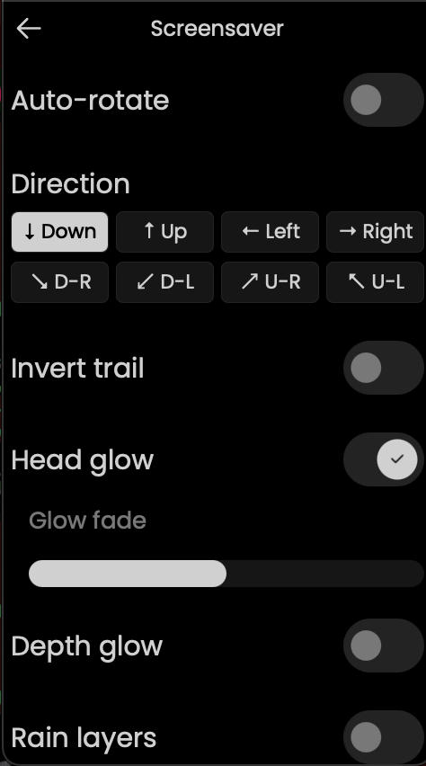 |

| Glitch & Chaos | Tap Effects | Messages & Behavior |
|:--------------:|:-----------:|:-------------------:|
| 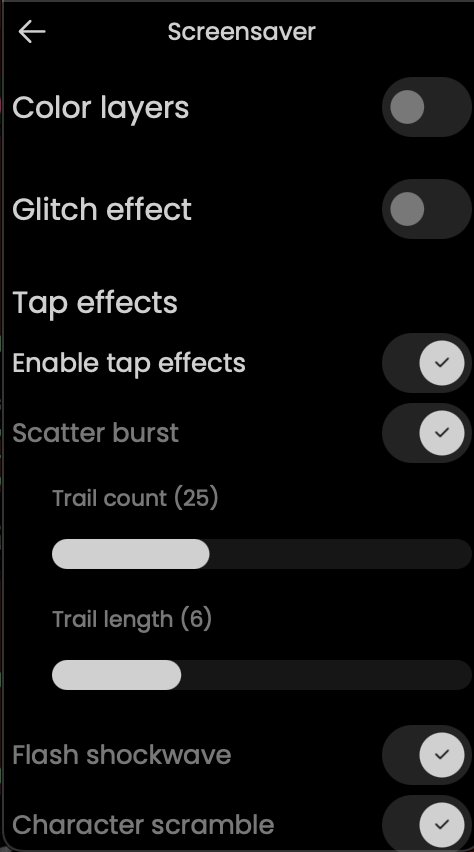 | 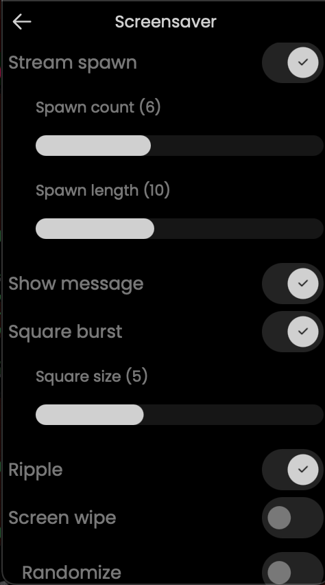 | 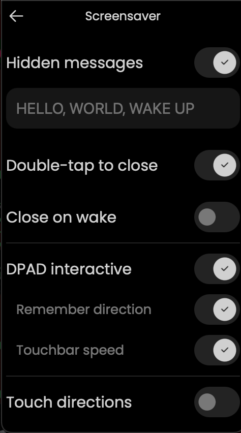 |

| DPAD & Touch |
|:------------:|
| 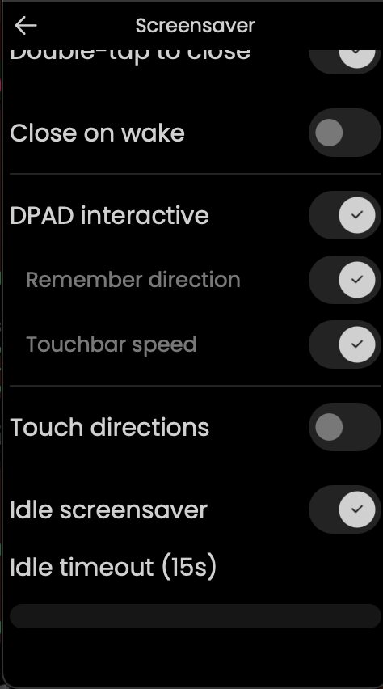 |

### Settings — Starfield

| Speed & Density | Star Size & Trail |
|:---------------:|:-----------------:|
| 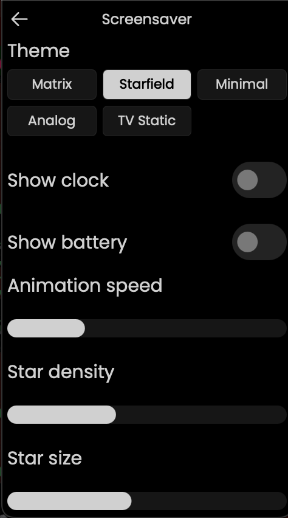 | 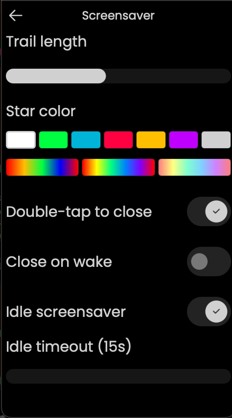 |

### Settings — Minimal

| Font & Time Color | Date & Sizes |
|:-----------------:|:------------:|
|  |  |

### Settings — Analog

| Analog Settings |
|:---------------:|
| 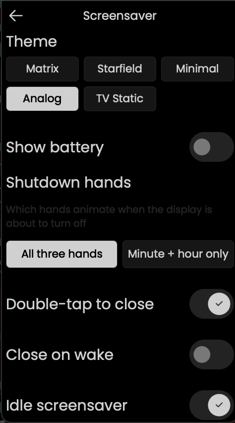 |

### Settings — TV Static

| Snow & Scanlines | Chroma & Tracking | Channel Flash | Tint |
|:----------------:|:-----------------:|:-------------:|:----:|
| 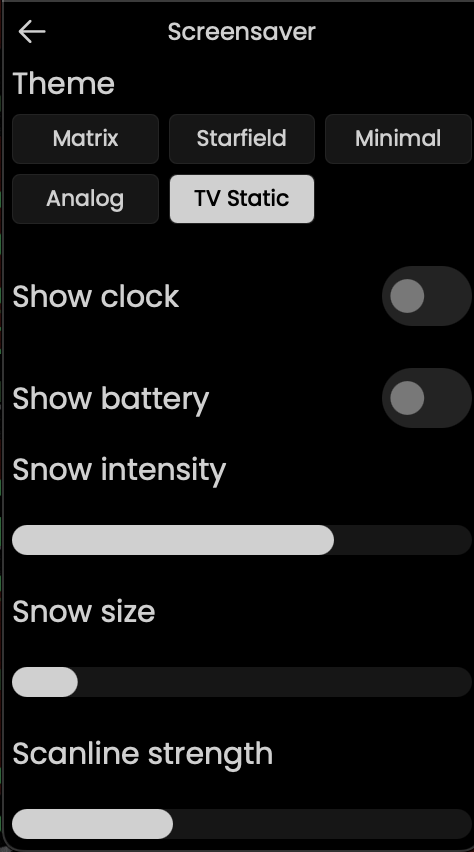 | 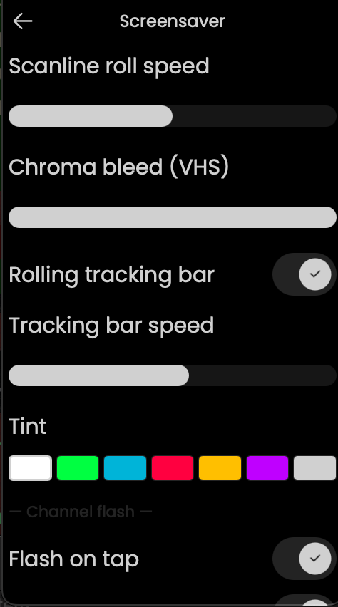 | 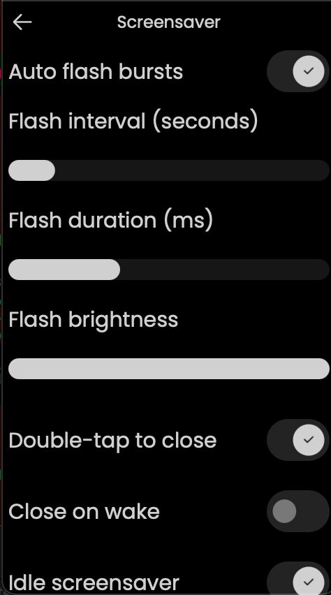 | 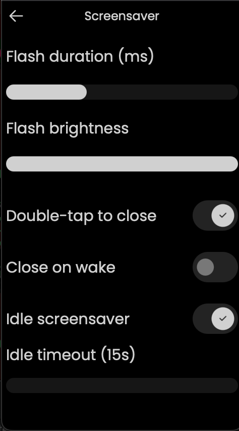 |

## Features

### Themes

- **Matrix Rain** — GPU-accelerated falling character rain with full customization (see below)
- **Starfield** — animated star field with configurable speed, density, star size, trail length, and color (7 solid + 3 rainbow gradients). Touchbar adjusts density, swipe adjusts speed.
- **Minimal Clock** — clean digital clock with date, configurable font (Poppins / Space Mono), size, and independent time/date color pickers with rainbow gradient support (battery overlay optional)
- **Analog Clock** — UC's stock analog clock face with hour dots and second/minute/hour hands (battery overlay optional)
- **TV Static** — single-pass GPU fragment shader composing analog dead-channel snow, VHS chroma bleed, CRT scanlines, rolling vertical-hold tracking bar, and channel-flash bursts. Full visual and cadence control.

### Matrix Rain

**Appearance:**
- 9 color modes — Green, Blue, Red, Amber, White, Purple, Rainbow, Rainbow+, Neon
- 4 character sets — Katakana, ASCII, Binary, Digits
- Adjustable font size, animation speed, column density, trail length, trail fade
- Invert trail direction (bright tail instead of bright head)
- Head glow toggle
- Glow fade slider — controls how long residual glow persists (0 = none, 100 = maximum). Prevents screen fill-up in rainbow modes.

**Visual Effects:**
- **Rain layers** — 3 independent rain grids at different font sizes (far=small/slow, mid=normal, near=large/fast). Creates depth through physical size difference. Toggle in settings.
- **Color layers** — per-stream atmospheric color tinting via custom GPU shader (texture × per-vertex RGBA). Continuous gradient from dim teal (slow streams) to bright chartreuse (fast streams). Toggle + intensity slider + overlay mode.
- **Depth glow** — residual glow cells shrink with age, creating a depth illusion where fading characters appear to recede. Toggle + min size slider.

**Direction & Movement:**
- 8-way direction control (cardinal + diagonal) via settings, DPAD, or touch zones
- Auto-rotate — continuous 360-degree direction sweep with smooth curved trails
- Configurable rotation speed and trail bend (curve tightness)
- Per-stream lerp produces visible curves during direction changes
- Direction-agnostic grid — streams fill the screen evenly in any direction

**Glitch Effects (individually toggleable):**
- Character swap — trail characters randomly change
- Brightness flash — random cells spike to full brightness
- Column flash — entire columns flash bright
- Column stutter — stream heads pause briefly
- Reverse glow — dim cells briefly brighten
- Direction change — glitch trails shoot in configurable directions
- Adjustable glitch intensity

**Chaos Events:**
- Surge (full-screen flash)
- Scramble (character mutation wave)
- Freeze (all streams pause)
- Square burst (expanding square outline overlay)
- Ripple (expanding circular ring overlay)
- Screen wipe (brightness wave sweeps across screen)
- Scatter (burst of glitch trails from random points)
- Configurable frequency, intensity, and individual sub-type toggles
- Square burst has independent size slider

**Hidden Messages:**
- Configurable message text (comma-separated)
- 5 message directions — horizontal L/R, vertical T/B, stream-aligned
- Messages always read naturally regardless of rain direction (no mirroring)
- Surrounding flash and brightness pulse toggles
- Adjustable message interval and random ordering

**Subliminal Messages:**
- In-stream injection — single characters appear in active streams
- Overlay spanning — full message text positioned across the screen
- Flash mode — brief full-brightness reveal
- Configurable interval and duration

**Tap Interaction:**
- **Master "Enable tap effects" toggle** — single switch that disables every tap effect at once. When off, taps still wake/cancel screen-off animations but produce no visual effect on the rain. All sub-options collapse from the settings page so only the master toggle shows.
- Single tap — corruption burst at touch point with configurable effects:
  - Scatter burst (glitch trails explode from tap) — configurable count + length
  - Flash shockwave (nearby streams flash)
  - Character scramble (randomize cells around tap)
  - Stream spawn (new streams from tap point) — configurable count + length
  - Message injection (hidden message at tap point)
  - Square burst (expanding square outline overlay) — configurable size
  - Ripple (expanding circular ring overlay)
  - Screen wipe (brightness sweep from tap point)
- Randomize mode — each effect gets an independent coin flip per tap
- Double-tap to close screensaver (toggleable)

**Touch-Zone Directions (alternative to DPAD):**
- Screen split into 3×3 grid — tap a zone to change rain direction
- Center zone: tap 1-2 = glitch + effects, tap 3 = restore direction, tap 4 = close
- Edge zones: every tap fires direction + effects
- Mutually exclusive with DPAD interactive
- Remember direction toggle — persists last touch direction between sessions

**Swipe & Hold Gestures:**
- Swipe up/down — adjust rain speed when touch direction mode is on (toggleable)
- Hold — staged slowdown: 500ms = 3× slow, 1500ms = pause. Release resumes.

**DPAD Interaction:**
- Arrow keys change rain direction in real-time
- Volume/Channel buttons map to diagonal directions
- Enter: single tap = chaos burst, double-tap = restore direction, hold = slow motion
- DPAD interactive toggle (enable/disable all DPAD controls)
- Direction persistence — remembers last DPAD direction between sessions (toggleable)
- Touchbar speed — swipe the touchbar to adjust animation speed (toggleable, visible when DPAD is on). Sensitivity tuned ~3× less twitchy in v1.4.8 — full 10→100 sweep now takes ~270 px of slider travel instead of ~90 px.
- When DPAD interactive is OFF, all DPAD buttons dismiss the screensaver

### TV Static

**Visual composition (single GPU fragment-shader pass):**
- **Luma snow** — hash-based per-pixel grayscale noise. Adjustable intensity and *snow size* (1–8 px cells, quantized for that chunky "big pixel" analog feel)
- **VHS chroma bleed** — faint offset hash lookups in R and B channels produce the red/blue chroma ringing of an old VHS tape
- **CRT scanlines** — hard alternating rows with configurable strength and bi-directional roll speed (negative = up, 0 = static, positive = down)
- **Rolling tracking bar** — Gaussian soft band drifting vertically at configurable speed, like VHS vertical-hold drift
- **Channel-flash bursts** — bright white flash overlays. Fully configurable:
  - On-tap (tap anywhere = flash)
  - Auto cadence (jittered interval, 3–120 s with ±50 % randomness)
  - Flash duration (80–1000 ms)
  - Flash brightness (0–100 %)
- **Tint color** — 7 solid swatches (white, matrix green, neon blue, red, amber, purple, grey) tints the whole frame

### Overlays

- **Clock** — digital time display with configurable font, size, color (7 solid + 3 rainbow gradients), 24h/12h toggle, optional date line with **independent date color** (7 solid + 3 rainbow) and own size slider, "charging only" visibility
- **Battery** — color-coded by charge level (green → yellow → orange → red), shows "Fully charged" at 100%, configurable text size, "charging only" visibility option

### Screen-off Animations

A shared pre-display-off animation system. When the core decides it's time to dim and blank the display, a short animation plays right before the hardware powers off.

**How it's triggered:** event-driven via the core's `Normal → Idle` power-mode transition (the moment the display actually starts dimming). The system then measures the real duration of the dim phase on each cycle and times the animation so it ends exactly at `Idle → Low_power` (the hardware blank). No baseline drift, no guessing — dim-phase duration is self-calibrating across dock states and config changes. A 200 ms polling fallback remains in place in case the `Idle` signal is missed.

**Tier 1 — Shared overlay (any theme)**, 8 styles:

*Draw-over styles (no theme sampling — zero GPU overhead beyond the shader pass):*
- **Fade** — simple monotonic black ramp. Safe baseline.
- **Flash** — brief white pulse followed by cut to black. Classic "TV zap off".
- **Iris (vignette)** — circular black mask closes from edges to centre. Soft smoothstep edge. (Uses a small inline GLSL shader for the radial mask.)
- **Wipe** — black rectangle sweeps top-to-bottom like an old film projector.
- **Wave** — soft cyan gradient wave travels from top to bottom, dimming everything behind it.

*Theme-sampling styles (distort the underlying theme's rendering via a captured-texture shader):*
- **Genie** — theme content shrinks and slides toward the bottom of the screen via an inverse-scale UV transform. Uniform-shrink, not a fluid mesh-warp ribbon (Qt 5.15 limitation: fragment-shader-only), but visually "zoom to corner". Outside the shrinking rectangle masks to black.
- **Pixels** — theme progressively pixelates into bigger and bigger blocks (0.5% → 8% of screen width), then the pixelated output fades to black.
- **Dissolve** — theme blends into per-pixel white noise, progressively shifting to pure noise, then the noise fades to black.

The sampling-based styles use a single `ShaderEffectSource` to capture the active theme into an offscreen FBO so the overlay shaders can sample it. The FBO is only allocated when one of the sampling styles is actually playing — non-sampling styles and the theme-native mode keep zero GPU cost.

**Tier 2 — Theme-native animations**: themes can opt in with their own tightly-integrated shutdown effect via an optional protocol (`providesNativeScreenOff`, `screenOffLeadMs`, `startScreenOff() / cancelScreenOff() / finalizeScreenOff()`). Currently **TV Static** uses this for a classic **CRT collapse** — the snow and scanlines collapse vertically into a bright horizontal line, then the line shrinks horizontally to a single dot, then the dot fades to black. 800 ms collapse + 500 ms black hold so it finishes synchronized with the real hardware display-off.

All other themes (Matrix, Starfield, Analog, Minimal) use the Tier 1 shared overlay exclusively. Matrix briefly had a native cascade prototype in earlier builds; it was rolled back in v1.2.1 because the running-binding pause/resume race on wake left the rain area black across multiple cycles. The shared styles are architecturally simpler, work reliably on every theme, and don't fight Qt's scene graph lifecycle.

**Controls:** `Settings → Power saving → Screen off animations`:
- **Enabled** — master on/off (default on)
- **Fire when undocked** — also plays on battery idle-timeout (default off). Turning this on also auto-cascades so the screensaver actually opens on battery (you don't need a separate toggle).
- **Style picker** — Fade / Flash / Iris / Wipe / Theme. "Theme" defers to the theme's native implementation if it has one, otherwise falls back to fade.

### General Behavior

- **Double-tap to close** — dismiss screensaver with a screen double-tap (touch-zone mode: 4-tap center)
- **Close on wake** — automatically close when picking up the remote
- **Any physical button dismisses** — all remote buttons close the screensaver unconditionally
- **Idle screensaver** — activate screensaver after configurable idle timeout (15-55s) when undocked
- **Display power gating** — animation pauses when display is off, resumes on wake
- **Touchbar isolation** — volume, seek, brightness, and position sliders are fully suppressed while the screensaver is active. Touchbar is used for screensaver controls (Matrix: speed, Starfield: density). *Completeness fixed in v1.4.7:* prior isolation was press-only — the XChanged and Released handlers in the 4 TouchSlider variants were still committing stale values to the active media_player entity (most visibly: Kodi volume getting overwritten on release every time you adjusted screensaver speed). All three handlers now bail when `screensaverActive` is true.

## Settings Reference

All settings are in **Settings > Screensaver** on the remote.

| Section | Settings | Themes |
|---------|----------|--------|
| Theme | Matrix / Starfield / Minimal / Analog / TV Static | All |
| Overlays | Show clock (+ charging only, font, color, size, 24h, show date + date size + **date color (7 solid + 3 rainbow)**, position: top/center/bottom), Show battery (+ charging only, text size) | Matrix/Starfield/TV Static |
| Overlays | Show battery (+ charging only, text size) | Minimal/Analog |
| Appearance | Color, Characters, Font size, Speed, Density, Trail, Fade | Matrix |
| Direction | Auto-rotate, Rotation speed, Trail bend, Direction picker | Matrix |
| Visual | Invert trail, Head glow, Glow fade, Depth glow (+ min size), Rain layers, Color layers (+ intensity + overlay) | Matrix |
| Glitch | Master toggle, Intensity, Column flash/stutter, Reverse glow | Matrix |
| Direction Glitch | Toggle, Frequency, Length, 8 direction toggles, Fade, Speed, Random color | Matrix |
| Chaos | Toggle, Frequency, Intensity, Surge/Scramble/Freeze/Square burst (+ size)/Ripple/Wipe/Scatter (+ freq + length) | Matrix |
| Tap Effects | Burst (+ count + length), Flash, Scramble, Spawn (+ count + length), Message, Square burst (+ size), Ripple, Wipe, Randomize + chance | Matrix |
| Subliminal | Toggle, Stream/Overlay/Flash modes, Interval, Duration | Matrix |
| Messages | Text input, Interval, Random order, Direction, Flash, Pulse | Matrix |
| Starfield | Animation speed, Star density, Star size, Trail length, Star color (7 solid + 3 rainbow) | Starfield |
| Minimal | 24-hour clock, Font (Poppins / Space Mono), Time color (7 solid + 3 rainbow), Date color (7 solid + 3 rainbow), Clock size, Date size | Minimal |
| TV Static | Snow intensity, Snow size (1–8 px), Scanline strength, Scanline roll speed, Chroma bleed, Rolling tracking bar (+ speed), Tint color, Channel flash (on-tap + auto bursts + interval + duration + brightness) | TV Static |
| Screen off animations | Enabled, Fire when undocked, Style (Fade / Flash / Iris / Wipe / Wave / Genie / Pixels / Dissolve / Theme-native) | All (lives under **Power saving**, not Screensaver) |
| Behavior | Double-tap to close, Close on wake, Idle screensaver, Idle timeout | All |
| Interaction | DPAD interactive (+ remember direction + touchbar speed), Touch directions (+ remember direction + swipe speed) | Matrix |

## Installation

> ### ⚠ If anything goes wrong — **REVERT FIRST, DIAGNOSE LATER**
>
> ```bash
> curl -X PUT "http://<remote-ip>/api/system/install/ui?enable=false" \
>     -u "web-configurator:<pin>"
> ```
>
> This disables the custom UI and hands control back to the stock UC firmware immediately. It's a fully supported UC3 API and cannot brick the device — the stock Qt UI process is always available as a fallback. **Save this command before you install anything.** If the UI fails to load, shows a black screen for >30 s, or you lose access to Settings, run the revert and your device is back to stock. Full backstop, no recovery tools needed.

### Requirements

- **Unfolded Circle Remote 3** — **tested only on firmware 1.9.x** (maintainer device). Other firmware versions have **not** been validated; an ABI mismatch against the UC3's Qt 5.15.8 static runtime would cause the custom UI process to fail to start. If that happens, run the revert command above and stock firmware resumes.
- **Hardware revisions:** only tested on the maintainer's device. If UC ships a silicon/display/touch revision, our untested code paths may differ.
- **Warranty:** installing anything here requires `?void_warranty=yes`. Upstream UC will not support the device while the custom UI is active. The revert endpoint restores stock and puts the warranty state back in UC's hands.
- **Docker** — for cross-compilation if you're building from source.

### Build & Deploy

```bash
# Cross-compile for ARM64
cd "/path/to/UC-Remote-UI"
docker run --rm --user=$(id -u):$(id -g) -v "$(pwd)":/sources \
    unfoldedcircle/r2-toolchain-qt-5.15.8-static:latest

# Package and install
cp binaries/linux-arm64/release/remote-ui deploy/bin/
cd deploy && tar -czf ../matrix-charging-screen.tar.gz release.json bin/ config/
curl --location "http://<remote-ip>/api/system/install/ui?void_warranty=yes" \
    --form "file=@../matrix-charging-screen.tar.gz" \
    -u "web-configurator:<pin>" --max-time 120
```

The UI restarts automatically after installation.

### Desktop Preview (macOS)

```bash
# Build natively (requires Homebrew Qt 5.15)
qmake && make -j$(sysctl -n hw.ncpu)

# Run with dev model flag
UC_MODEL=DEV "./binaries/osx-x86_64/release/Remote UI.app/Contents/MacOS/Remote UI"
```

### Revert to Stock

```bash
curl -X PUT "http://<remote-ip>/api/system/install/ui?enable=false" \
    -u "web-configurator:<pin>"
```

## Technical Details

- **Matrix renderer:** C++ QQuickItem with custom `MatrixRainShader` (texture × per-vertex RGBA) — single GPU draw call per frame
- **TV Static renderer:** Qt 5.15 `ShaderEffect` with inline GLSL ES 2.0 fragment shader. All six visual layers (snow, chroma, scanlines, tracking bar, intensity, channel flash) composed in a single full-frame pass. Pure QML — no C++ additions.
- **Screen-off animation system:** two-tier architecture in `ChargingScreen.qml`. **Tier 1** shared `ScreenOffOverlay.qml` draws one of N styles above the active theme via a single `progress: 0..1` property. **Tier 2** optional theme-native protocol (`providesNativeScreenOff`, `screenOffLeadMs`, `startScreenOff/cancelScreenOff/finalizeScreenOff`) lets themes take over rendering entirely. Trigger is event-driven via `Power.powerModeChanged` on `Normal → Idle` with empirical dim-phase measurement (self-calibrating, zero baseline math). 200 ms wall-clock poller as fallback.
- **Simulation (Matrix):** Pure C++ (no Qt object system) — deterministic, cache-friendly
- **Config bridge:** ScreensaverConfig C++ singleton — owns its own QSettings instance (zero custom lines in upstream config.h), SCRN_* macros for single-declaration properties
- **GradientText:** Reusable QML component for solid or rainbow gradient text via QtGraphicalEffects LinearGradient (zero GPU overhead when solid)
- **Atlas caching:** Static in-memory cache of the combined multi-layer glyph atlas (~3.7 MB). Survives dock/undock cycles (process stays alive, only QML is recreated). First dock builds the atlas (~8s on ARM64); repeat docks skip rasterization entirely (~5s — remaining time is QML lifecycle). Cache key: SHA-1 of color, colorMode, fontSize, charset, fadeRate, depthEnabled. Invalidates automatically on settings change.
- **Tests:** ~280 total (~84 C++ matrixrain unit tests + ~195 QML functional tests across Matrix, Starfield, Minimal, Analog, TvStatic lifecycles, settings bindings/visibility/navigation, config defaults, enter-state machine), CI green via build.yml + test.yml + tidy.yml + code_guidelines.yml
- **Display power gating:** Zero CPU/GPU when screen is off
- **Font:** Bundled 23KB Noto Sans Mono CJK JP subset (katakana + digits)

For architecture details, see [SCREENSAVER-IMPLEMENTATION.md](SCREENSAVER-IMPLEMENTATION.md).
For build instructions, see [BUILD.md](BUILD.md).

## Release History

> **Note on v1.2.2:** the `v1.2.2` git tag was moved forward on 2026-04-13 after the initial tag push to include a handful of post-tag fixes that hadn't been caught before the tarball shipped (first-boot button lockout, MinimalTheme date rendering, clang-tidy CI fix, avatar cleanup, docs refresh). The shipped GitHub Release artifact `remote-ui-v1.2.2-UCR2-static.tar.gz` is the post-move build and includes everything listed below. Anyone who grabbed the original v1.2.2 tarball (before the move) should re-download — the SHA256 hash differs.

**Unreleased (on `main`, post-v1.2.2)** — settings-freeze fix + atlas profiling overlay + dead-code sweep + hot-path polish
- **Fixed** Settings → Screensaver page stalling visibly when opened. Root cause: `ChargingScreen.qml` (the settings page) was unconditionally instantiating all six theme-dependent sub-pages on every open, then gating each with `visible: ScreensaverConfig.theme === "..."`. Qt still compiled + bound + laid out every theme's full settings UI — ~100+ child items across 15+ sliders, color pickers, switches, repeater rectangles — on every open, even though only one theme's page was visible. Fix: wrap each theme sub-page in `Loader { active: theme === "..."; sourceComponent: inlineComponent; asynchronous: true; visible: status === Loader.Ready }` so only the currently-selected theme's sub-page exists at any moment. The `sourceComponent:` + inline `Component { }` pattern (not `source:` + `onLoaded`) is required because every sub-page declares `required property Item settingsPage`, which Qt 5.15 enforces at construction time — `onLoaded` sets the property too late and leaves `Loader.item` null with all content invisible (burned by this on the first deploy). Also extracted the two inline `starfieldSettings` / `minimalSettings` ColumnLayouts (~300 lines) into their own `StarfieldSettings.qml` / `MinimalSettings.qml` files to match the existing pattern of the other four sub-pages.
- **Added** a new **"Atlas profiling overlay"** toggle at the bottom of Settings → Screensaver → General Behavior (matrix-theme-only). When enabled, a small green text strip renders at the top of the Matrix rain showing the live phase timings of the most recent `buildCombinedAtlas` pass (cache-hit/miss, per-layer build ms, compose ms, remap ms, total ms, ctor-to-first-paint ms). Backed by a new `MatrixRainItem::lastBuildSummary` `Q_PROPERTY` populated by `QElapsedTimer` instrumentation around `updatePolish` + `buildCombinedAtlas` + `updatePaintNode`. Off by default. Useful for future on-device profiling without needing `qCInfo` output (which `lodgy` doesn't surface usefully on UC3).
- **Removed** the orphan "Shutdown animation" settings sub-section from the Matrix theme settings. `MatrixShutoffSettings.qml` + the `matrixShutoffStyle` + `matrixShutoffDuration` config keys + its qrc entry + its translation strings across eight `.ts` files were dead cruft left over from the v1.2.1 removal of the Matrix theme-native cascade screen-off animation — the settings panel for a feature that no longer exists. Swept cleanly (-264 lines). The `navUpTarget` reference in `generalBehavior.navUpTarget` that was silently falling through to the next ternary branch is also gone.
- **Documented Path A decision on cold-dock latency.** On-device profiling via the new debug overlay revealed that cold-dock cost at the heavy config (`rainbow_gradient / katakana / size=39 / layers=on`) is ~3.5 s with `composeMs` at 33% of the total — the 3× `QPainter::drawImage` blit into a ~332 MB combined atlas image. Two optimization tiers were evaluated (eliminate compose via per-layer `QSGTextures`; shader-side brightness) and explicitly rejected as not worth the cost: cold dock is a rare event (once per UI restart), repeat docks already run in ~99-158 ms via the existing in-memory static atlas cache. Cache stays as-is. Decision + phase table documented in `SCREENSAVER-IMPLEMENTATION.md`.
- **Performance polish** — `ClockOverlay.qml` date string now uses a one-minute-interval `Timer` + cached property instead of recomputing on every 1Hz `ui.time` tick (98% fewer recomputes per day); `matrixrain.cpp` render hot path now reuses two shared member `QVector`s (`m_sortOrder`, `m_streamColorCache`) across `countVisibleQuads` + `renderStreamTrails` + their multi-layer variants instead of reallocating per frame (steady-state zero heap churn on the render path).
- **Chore** — reverted `src/hardware/hardwareController.{h,cpp}` whitespace-only differences against upstream (pure blank-line churn, zero semantic change — shrinks fork diff surface for future merges); refreshed `docs/CUSTOM_FILES.md` manifest with ~10 missing entries for modified-upstream and custom files that had accumulated silently; documented in `src/ui/screensaverconfig_macros.h` + `src/ui/screensaverconfig.h` that the macro-expanded getters intentionally read through `QSettings::value()` on every call (Qt 5.15 INI backend is in-memory, NOT disk I/O — a prior audit claim to the contrary was wrong) and that the five hand-written non-macro `Q_PROPERTY` blocks must be preserved to avoid reintroducing the Qt 5.15 MOC signal-chain bug from commit `47b6d59`.

**v1.2.2** (2026-04-13) — screensaver bug fixes + thermal sim pause + hygiene sweep + post-release polish

*User-reported bug fixes (Batch 0):*
- **Fixed** "Close on wake" toggle being completely ignored on undock. The `Battery.onPowerSupplyChanged(false)` handler in `main.qml:588-601` unconditionally called `chargingScreenLoader.item.close()`, while the sibling `Power.onPowerModeChanged` handler correctly respected `ScreensaverConfig.motionToClose`. One-line fix mirrors the existing check — the toggle now consistently gates both wake paths.
- **Fixed** Matrix/Starfield themes sometimes staying black after the screen-off animation finished. Root cause: neither theme had declared `cancelScreenOff()`, so the defensive dispatch at `ChargingScreen.qml:162-163` was a no-op, and the `MatrixRainItem::resetAfterScreenOff()` C++ helper (added in v1.2.1 as a wake-refresh hook) was dead code. Wired both themes to the hook — Matrix calls `matrixRain.resetAfterScreenOff()`, Starfield calls `canvas.requestPaint()` — and added `themeLoader.item.update()` belt-and-suspenders in `cancelScreenOffEffect()`. Also preemptively removed the latent `!root.displayOff` gates from TvStaticTheme's Timer bindings (same pattern fbf9028 fixed for Matrix/Starfield).
- **Fixed** "Idle screensaver" off toggle having no effect — the popup still opened after `idleTimeout` expired even with the toggle disabled. The `_shouldOpenOnIdle()` helper was gated only in the happy path; added the same guard on the idle-timer fallback path in `main.qml`.
- **Fixed** display-off gap on undock: screen-off animation started ~3 s after undock and then the display stayed powered on for ~7 s before blanking. Retimed the cascade — animation fires at `displayTimeout` after undock (not earlier), blackout-to-display-off gap is now <2 s.
- **Fixed** first-boot button lockout — every physical remote button (BACK, HOME, MENU, VOICE, colour keys, transport, etc.) is wired to close the screensaver, but on the very first popup open the async `themeLoader` often hadn't realized its child item yet when `Popup.onOpened` fired. The existing `if (themeLoader.item)` guard around `buttonNavigation.takeControl()` silently skipped the push, leaving the main-app `ButtonNavigation` in control and no button handler reachable. Only tap worked (routes through `MouseArea`, bypassing `ButtonNavigation`). Fix: drop the guard and re-call `takeControl()` in `themeLoader.onLoaded` as belt-and-suspenders — stack push with the same scope is idempotent.
- **Fixed** MinimalTheme date line rendering blank. Root cause: Batch C had replaced the hardcoded English day/month arrays with `Qt.formatDateTime(new Date(), "dddd, MMM d", Qt.locale())`, which silently returns empty in Qt 5.15 because the 3rd argument is a `Locale.FormatType` enum, not a `Locale` object. First fix attempt (`Qt.locale().toString(new Date(), "dddd, MMM d")`) rendered literal `"[object Object]"` because the QML `Locale` type has no `toString(date, format)` method — falls through to `Object.prototype.toString()`. Correct fix: `new Date().toLocaleDateString(Qt.locale(), "dddd, MMM d")` — the Qt QML extension on JS `Date.prototype` that accepts a Qt Locale object plus a format string.

*Thermal + performance:*
- **Fixed** the remote getting unnecessarily warm while the screensaver was on. `MatrixRainItem::setDisplayOff()` now also flips the internal tick timer off — the sim stopped rendering in v1.2.1 but was still ticking state updates during display-off, enough to warm the SoC on a sustained dock. Verified cool-running on 10+ minute dock sessions.
- **Fixed** DPAD/touch direction changes respawning the rain instead of bending it smoothly via the gravity lerp. The direction state was being reset imperatively on every direction input. Route direction changes through `GravityDirection::setDirection()` so the per-stream angle lerp takes over.

*Infrastructure + hygiene (batches A–G):*
- **Batch A** — version sync gate in `build.yml` (fails when `remote-ui.pro` VERSION ≠ `release.json` ≠ latest git tag); credentials stripped from all tracked docs and replaced with `.env.local` references; Mod 2 Avatar status corrected from "planned" to "archived"; 60 MB of tracked tarball/Makefile debt purged; `CRITICAL` landmine comment added to `AnalogTheme.qml:120` for the Qt 5.15 qmlcachegen binding race.
- **Batch B** — strict warning flags enabled (`-Wall -Wextra -Werror=format`, `-Wold-style-cast`, `-Wfloat-equal`, `-Woverloaded-virtual`, `-Wshadow`) and the full cascade fixed in `src/ui/*`; Matrix hot-path UV index bounds tightened with a new negative regression test.
- **Batch C** — `.githooks/pre-commit` running `cpplint.sh` + `clang-format --dry-run -Werror`; i18n baseline populated via `lupdate`; new `docs/UPSTREAM_MERGE.md` playbook; CHANGELOG sync gate in the release workflow; `BaseTheme.qml` `cancelScreenOff` doc clarified as the wake-refresh hook.
- **Batch D** — clang-tidy in CI via `.github/workflows/tidy.yml` with a starter ruleset (`modernize-*`, `bugprone-*`, `cert-*`, `performance-*`), tolerant baseline mode, per-file NOLINT with explanations for intentional upstream-compat cases.
- **Batch E** — dead `CFG_*` macro family deleted from `src/config/config_macros.h` (zero call sites), `SCRN_*` documented as canonical in `STYLE_GUIDE.md §6.6`; four new QML theme lifecycle tests (`tst_starfield.qml`, `tst_minimal.qml`, `tst_analog.qml`, `tst_tvstatic.qml`).
- **Batch F** — GPG release signing pipeline (`docs/RELEASE_SIGNING.md`, `scripts/verify-release.sh`, signing step in `release.yml`); canary deploy with auto-revert on health-check failure (`scripts/deploy-canary.sh`, `scripts/mock-uc3-api.py` for local rehearsal).
- **Batch G** — upstream merge rehearsal executed (fork is strict superset of `upstream/main@0586d45`, zero conflicts); `docs/A11Y_AUDIT.md` checklist; two language translations populated (`de_DE.ts`, `fr_FR.ts`); `sbom.cdx.json` CycloneDX SBOM.

*Docs + chore:*
- **Removed** all Mod 2 (Avatar) references from the repo. Every mention in docs, every prototype file, the dormant `braille` charset branch in `glyphatlas.{h,cpp}`, the `BrailleFont.ttf` bundle, and the `.gitignore` block were stripped. Research is preserved losslessly in an external archive (`/Users/madalone/_Claude Projects/UC-Remote AVATAR Project/`) with pre-strip originals of every edited file and a `FINDINGS.md` index for future resumption.
- **Rewrote** `README.md` — previous README was the UC upstream one describing Remote Two and the stock firmware. New README highlights the fork identity (5 themes, install/verify/revert, architecture, release signing, upstream relationship, v1.2.2 history), adds a "How this was built" section (vibecoding loop + audits + testing + safety posture), a "Human-reviewed documentation" subsection, a "With love and thanks" acknowledgment for Jessica, the expanded 9-bullet screen-off animations section, pinned tested firmware range (1.9.x only, maintainer device only), and a loud revert-first install callout.
- **Refreshed** `SCREENSAVER-README.md` screenshot tables to match current `docs/screenshots/` contents: 5 theme heroes, common toggles, Matrix/Starfield/Minimal/Analog/TV Static settings tables (21 sub-pages total), Power saving → Screen off animations settings page, 9 textual style descriptions.
- **Fixed** clang-tidy CI — `.github/workflows/tidy.yml` now builds `libicu56` the same way `build.yml` does. Qt 5.15's `lupdate` requires `libicui18n.so.56` which Ubuntu 22.04 no longer ships, and `qmake` auto-invokes `lupdate` via the `.pro` file's `TRANSLATIONS` section, so the whole tidy job was failing at the qmake step.
- **Fixed** flaky `subliminalStreamWritesGrid` CI test. `RainSimulation`'s default ctor seeds `m_rng` from `std::random_device{}()`, so each CI runner got different entropy and the 5-attempt retry loop occasionally hit a run with no mature streams. Fix: deterministic `m_rng.seed(42)` + bumped attempt budget 5 → 30.
- **Rotated** GPG release signing key from `82236E0F07904BDC` → `3172A28DABF07621`. Original Batch F key was a sealed lockbox — its passphrase was generated inline via `$(openssl rand -base64 32)` during the gpg batch run and never captured. Regenerated as passphrase-less (appropriate for CI-only signing stored in GitHub Secrets). New public key published in `docs/release-pubkey.asc`; `v1.2.2` tag was re-pushed to produce a freshly-signed tarball verifiable via `scripts/verify-release.sh`.

**v1.2.1** (2026-04-13) — drop displayOff gate from running binding (fixes wake-black)
- **Fixed** rain going black on wake from any screen-off animation cycle. Root cause was a `running: visible && !isClosing && !displayOff` binding race: on wake, `setRunning(false) → setRunning(true)` fired in the same QML tick as `cancelScreenOffEffect` and `setSpeed`, and Qt does not guarantee binding / notifier / onChanged ordering. The race left the scene graph's first post-wake `updatePaintNode()` submitting an empty geometry node. Fix: drop `!displayOff` from the binding — the sim ticks through display-off (near-zero cost because Qt stops compositing when the display is off).
- **Removed** Matrix theme-native cascade animation. Matrix now falls through to the shared `ScreenOffOverlay` styles (fade / pixelate / dissolve / genie / etc.) same as Starfield and Minimal.
- **Removed** the Matrix shutdown animation settings section.
- **Fixed** `holdPauseTimer` was writing `matrixRain.running = false` imperatively from QML, permanently breaking the running binding on the theme instance. Replaced with new `Q_INVOKABLE pauseTicks()` / `resumeTicks()` C++ methods that stop and start the tick timer without breaking the binding.
- **Fixed** `postAnimationSafetyTimer` was closing the popup when the core's `Low_power` transition didn't fire within `leadMs + 1500ms`. On undocked setups where `Low_power` never fires, this was dumping the user to the home screen on every wake. Changed to set `displayOff = true` instead — popup stays alive.

**v1.2.0** (2026-04-13) — runtime slider wiring + tap master toggle
- **Fixed** the Matrix animation speed, density, trail length, fade, and color sliders silently having no effect on the live rain. Root cause was a signal-to-signal `connect` in `ScreensaverConfig`'s ctor that didn't route through correctly because the raw `matrix*Changed` signals were declared via macro while the transformed `*Changed` signals were declared in a separate manual `signals:` block — Qt's MOC + QML binding engine don't trace indirect signal chains. Fixed with the canonical Qt dual-emit pattern: hand-written setters emit both the raw and the transformed NOTIFY signal directly.
- **Added** master "Enable tap effects" toggle in the Tap section of the Charging Screen settings.
- **Bumped** `TICK_MAX_MS` from 150 to 300 so slider value 10 actually maps to a visibly slower tick.

---

### v1.3.x — v1.4.x (2026-04-23 → 2026-04-24)

**v1.3.0** — Mod 1 architectural cleanup + atlas profiling overlay + detail-page battery chip + Settings → Screensaver open-freeze fix.
- **Refactored** `matrixrain.cpp` from 2055 → ~1430 lines. Extracted `LayerPipeline` (multi-layer depth-plane subsystem, ~660 lines) and `AtlasBuilder` (single-layer atlas + canonical SHA-1 cache-key, ~115 lines) as pure-C++ collaborators on `MatrixRainItem`. Zero observable behavior change, `updatePaintNode` slimmed 214 → 164 lines. Deleted 8 dead `tap*()` wrappers verified zero-call-site by plan agent.
- **Fixed** Settings → Screensaver page stalling on open. Root cause: `ChargingScreen.qml` (the settings page) was unconditionally instantiating all six theme sub-pages on every open, then gating visibility — Qt compiled + laid out every theme's full settings UI regardless. Wrapped each sub-page in `Loader { active: theme === "..." ; asynchronous: true }` — only the currently-selected theme's sub-page exists at any moment.
- **Added** atlas profiling overlay toggle in Matrix → General Behavior. Shows live per-phase build timings (`cache=hit|miss`, per-layer `buildMs`, `composeMs`, `remapMs`, `totalMs`, `firstPaintMs`, `ctorToPaintMs`) — useful for on-device profiling without needing log capture.
- **Performance** — `ClockOverlay` date string recomputation 864k/day → 1440/day (98% reduction) via minute-cadence Timer + cached property. Matrix render hot path: `countVisibleQuads` / `renderStreamTrails` / multi-layer variants promoted their two per-frame scratch `QVector`s to shared `MatrixRainItem` members, saving ~200-500 µs/frame on dense scenes.

**v1.4.0** (2026-04-23) — upstream `v0.72.0` merge (Option B rebase)
- Brought in upstream's press-and-hold media browse gesture, 4-icon MediaComponent controls row (shuffle / repeat / browser / source), smarter media-browse error handling. UC independently shipped our Mod 3 battery-chip feature as "Show battery indicator everywhere" — adopted their public API, kept our superior Option A chain-anchoring `RowLayout` that handles 6 status indicators adaptively. One-shot QSettings migration (`main.cpp::migrateLegacySettings`) carries v1.3.0 user state forward (`ui/batteryOnDetailPages` → `ui/batteryEveryWhere`).

**v1.4.1–v1.4.5** (2026-04-24) — volume OSD / MediaBrowser / TouchSlider hardening
- **v1.4.1** — volume OSD feature-check guards at 7 previously-unguarded call sites (upstream bug). `volume.start()` was firing unconditionally even when the entity had removed `Volume_up_down` from its feature set. Added `hasFeature(...)` guards matching `Activity.qml`'s existing pattern across `Page.qml` + `MediaBrowser.qml` + 5 deviceclass files. Upstream-contributable.
- **v1.4.2** — `Config.showVolumeOverlay` user-preference toggle (`Settings → UI → Show volume overlay`, default on). Single early-return guard in `VolumeOverlay.qml::start()` covers all 16 call sites.
- **v1.4.3** — MediaBrowser unescapable-loading-loop hotfix. Pre-fix: a null `entityObj` race threw a TypeError mid-`onOpened`, `buttonNavigation.takeControl()` never ran, hardware keys went dead, `pageLoading: true` triggered global `LoadingScreen` with `inputController.blockInput(true)` and a 180 s timeout = 3-minute hard lockout + thermal risk. Fix: null-guard + replace `LoadingScreen` call with inline `BusyIndicator` + 15 s watchdog.
- **v1.4.4** — MediaBrowser full hardware-button coverage (MUTE / STOP / NEXT / PREV / CHANNEL_UP/DOWN as context-aware page-scroll) + 14-site volume split-guard refactor (command dispatch decoupled from OSD display) + new per-entity `hideVolumeOverlay` flag on MediaPlayer entity, ingested from ucapi `options["hide_volume_overlay"]`.
- **v1.4.5** — `TouchSlider.qml` null-guard. `startSetup()` top + Loader `y:` binding both hardened against null `entityObj` / null Loader-`item` during rapid card re-activation / source-clear transitions.

**v1.4.6** (2026-04-24) — quiet boot hygiene pass
- Boot-log warning count reduced ~177 → ~4 via four targeted fixes: `QNetworkReply::OperationCanceledError` filter at both `mediaPlayer.cpp` log sites (eliminates 167× per-boot image-cancel flood — these were supersession events, not failures), terminal `return ""` in `VoiceOverlay.qml:666` JS binding, missing `import TouchSlider 1.0` added to `main.qml` (also unmasked a silently-broken slider-to-idle-reset wiring that had been silently no-op'd via `ignoreUnknownSignals: true`), file-existence guard in `soundEffects.cpp::createEffects()` via new `makeEffect` lambda + null-checks in `play()` switch (eliminates 5× QSoundEffect decode warnings when `UC_SOUND_EFFECTS_PATH` is unset). Explicitly deferred: 2 cosmetic log-level downgrades (Empty ID getIcon, translation remove) — not worth the +1 drift each.

**v1.4.7** (2026-04-24) — TouchSlider screensaver guard completeness
- Physical slider touches during the screensaver were bleeding through to the active media_player entity — volume/seek/brightness/position writes were still committing on release. Root cause: the `applicationWindow.screensaverActive` early-return guard across all 4 TouchSlider*.qml variants was only on `onTouchPressed`. `onTouchXChanged` ran ungated (accumulated `targetVolume += Math.sign(rawDelta)` against stale state), and `onTouchReleased` ran ungated (`entityObj.setVolume(sliderContainer.targetVolume)` committed the stale target). Added the same guard to both handlers in all 4 variants — 8 one-liners, zero new drift.

**v1.4.9** (2026-04-24) — MediaBrowser thumbnail preview handoff + empty controls-bar auto-collapse
- **Added** `Q_INVOKABLE MediaPlayer::setPreviewImage(QString)` — MediaBrowser now hands its browse-time thumbnail to the `MediaPlayer` entity at tap time (via the existing 10 `requestPlayMedia(...)` call sites + the `buildPlayMenu` helper, centralized in `requestPlayMedia()` so the preview fires once per tap before `playMedia`). Bridges the "blank player widget after tap" gap for library-indexed content; zero ucapi contract change; `playMedia()` signature untouched.
- **Added** preview-preserve guard in `updateAttribute(Media_image_url)` — once a preview is showing, empty-URL updates + 12 canonical Kodi-default placeholders (`DefaultVideo.png` et al, case-insensitive substring, catches URL-encoded forms) are swallowed rather than blanking the thumbnail. Flag lifetime threaded via `reply->setProperty("isPreview", ...)` so a real-URL fetch failure (3 retries exhausted) preserves the preview instead of calling `clearMediaImageState()`.
- **Added** scheme filter on `setPreviewImage` — whitelists `http(s)://` and `data:image/…;base64,…` only. Rejects UC3 internal `icon://` (MediaBrowser's display-only fallback string; raw string, not a URL) and Kodi `image://` (unresolvable via QNAM without a Kodi JSON-RPC round-trip). Pre-filter, every tap of an unscraped item burned 3 × 1 s retries on `icon://uc:video` with `ProtocolUnknownError`; post-filter zero retry noise.
- **Fixed** empty controls-bar gap when all four v1.4.8 button toggles are off — `controlsContainerHeight` in `MediaComponent.qml:50` evaluates to 0 in that case, collapsing the 80 px `RowLayout` cleanly instead of reserving an empty row below the progress bar. Single-expression change; flows through the existing `mediaInfoHeight` calc; no new settings, no new qsTr strings.
- **Refactor** — extracted `applyMediaImageUrl(url, isPreview)` private helper from the existing `Media_image_url` attribute case so `setPreviewImage` and `updateAttribute` share one dispatch path. v1.4.6 `QNetworkReply::OperationCanceledError` filters at both log sites preserved verbatim.

**v1.4.8** (2026-04-24) — touchbar sensitivity /3 + media-button suppression toggles
- **Changed** screensaver touchbar speed/density control from 1:1 pixel-to-unit scaling to ~1:3. Raw delta now goes through `scaledDelta = delta / 3` before applying — full 10→100 sweep takes ~270 px of slider travel instead of ~90 px. Minimum 3 px dead zone unchanged.
- **Added** 4 new global Config toggles in `Settings → UI` to hide individual icons on the MediaComponent 4-icon controls row: `Show shuffle button` / `Show repeat button` / `Show media browser button` / `Show source picker button`. Q_PROPERTY + QSettings-backed (`ui/show*Button`, default `true` preserves upstream behavior on upgrade). AND-chained with existing `entityObj.hasFeature(...)` checks — a Config-disabled button always hides, but a Config-enabled button still respects entity capabilities. Motivation: integrations can't selectively strip individual `MediaPlayerFeatures` bits to hide a single button (stripping also disables the command); UC-side toggles solve at the display layer.

---

See [SCREENSAVER-IMPLEMENTATION.md](SCREENSAVER-IMPLEMENTATION.md) for detailed session logs and `_build_logs/` for per-release session notes.

## Roadmap

- ✅ **TV Static** — analog snow / VHS chroma / CRT scanlines / rolling tracking bar / channel-flash bursts (shipped 2026-04-10)
- ✅ **Screen-off animation system** — shared Fade / Flash / Iris / Wipe / Wave / Genie / Pixels / Dissolve + theme-native protocol with TV Static CRT collapse (shipped 2026-04-10)
- ✅ **v1.2.1 wake-black fix** — dropped the `displayOff` gate from the theme `running` binding. Matrix + Starfield sims now keep ticking through display-off, eliminating the QML binding / scene-graph race that left the rain area black on wake (shipped 2026-04-13)
- ✅ **v1.2.2 hygiene sweep** — 4 user-reported bug fixes, thermal sim-pause, DPAD respawn fix, strict warning flags (`-Wall -Wextra -Werror=format -Wold-style-cast -Wfloat-equal -Woverloaded-virtual -Wshadow`), clang-tidy CI, i18n baseline, `SCRN_*` macro unification, GPG release signing + canary deploy, upstream merge rehearsal (fork confirmed strict superset of `upstream/main`), SBOM, a11y audit, two real translations (shipped 2026-04-13)
- ✅ **Mod 2 Avatar cleanup** — every avatar reference stripped from the repo; research preserved losslessly in an external archive so work can resume in the future without digging git history (2026-04-13)
- ✅ **First-boot button lockout fix** — `buttonNavigation.takeControl()` now always runs in `onOpened`, re-runs in `themeLoader.onLoaded` as belt-and-suspenders (2026-04-13, post-v1.2.2)
- **Screenshots refresh** — update `docs/screenshots/` with TV Static theme + settings, Analog theme, Screen-off animations (Iris / Wave / Genie / Pixels / Dissolve), Minimal current look. All existing screenshots dated Apr 8, predate TV Static + screen-off animations + v1.2.0/1/2 Matrix UI changes.
- **Screen-off animations Batch 3** — additional shared overlay styles under consideration (Venetian blinds, Radial sweep, Barn doors, CRT degauss flash)
- ~~**Per-theme native screen-off animations**~~ — the native cascade was attempted for Matrix and rolled back in v1.2.1 because any theme that pauses its internal tick on display-off triggers a QML binding race with the scene graph on wake. Future theme-native effects should either use the TV Static model (C++ shader-driven, no ticking simulation underneath) or be implemented as pure visual overlays that do NOT mutate the underlying sim state.

## How This Was Built

This project was vibecoded — designed, implemented, and iterated entirely through conversation with [Claude Code](https://claude.ai/claude-code) (Anthropic's CLI agent). The C++ renderers, QML settings UI, GPU shader pipeline, config bridge architecture, test suite, CI workflow, and this README were all produced through iterative human-AI collaboration. No line was copy-pasted from a tutorial or LLM playground; every commit went through the same review loop: describe intent, generate code, test on device, refine.

The human side: architecture decisions, visual taste, UC3 hardware testing, and "that doesn't look right" feedback. The AI side: C++17/Qt 5.15 implementation, QSG scene graph plumbing, test generation, and debugging CI failures at 3am.

## License

GPL-3.0-or-later. Fork of [unfoldedcircle/remote-ui](https://github.com/unfoldedcircle/remote-ui).
