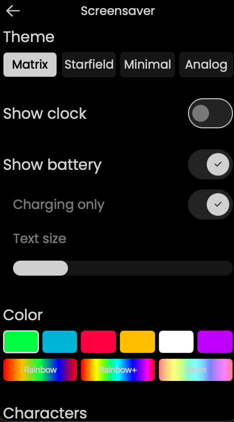
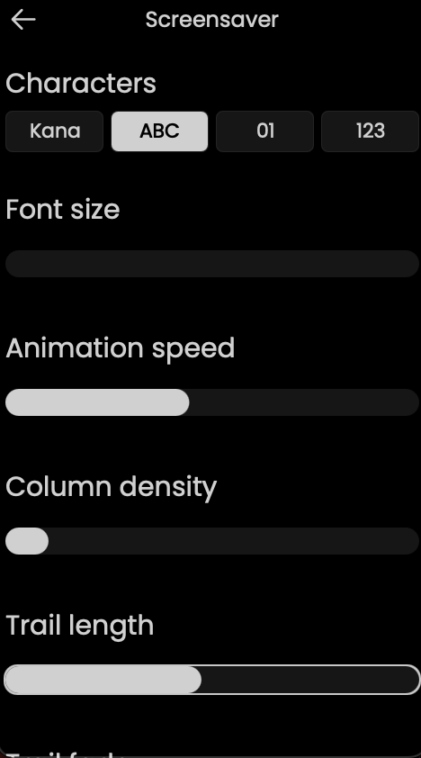
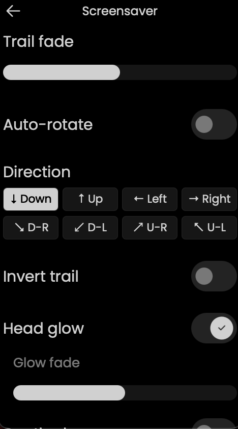
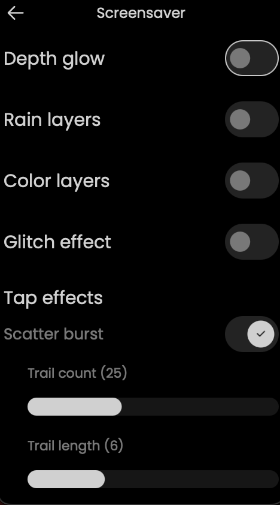
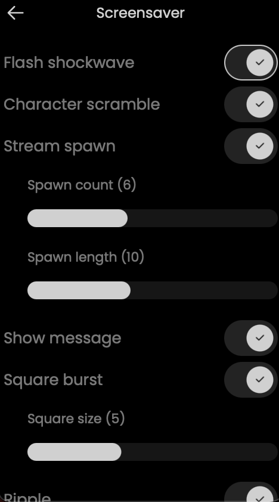
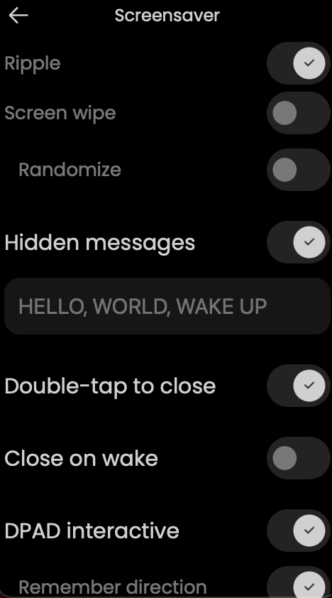
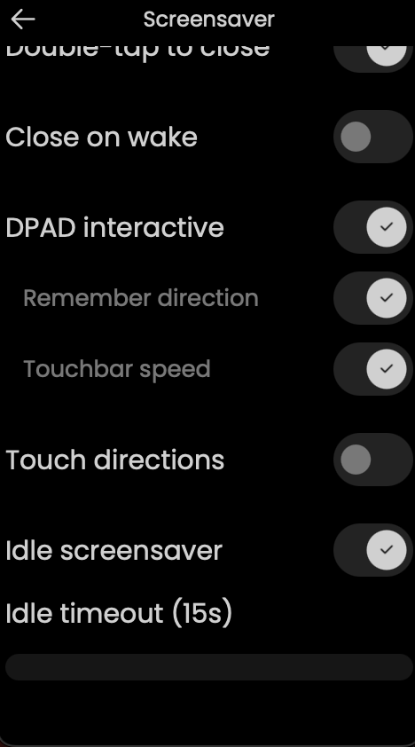
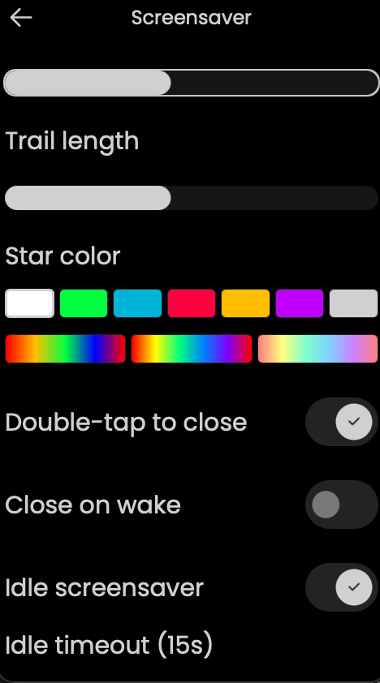
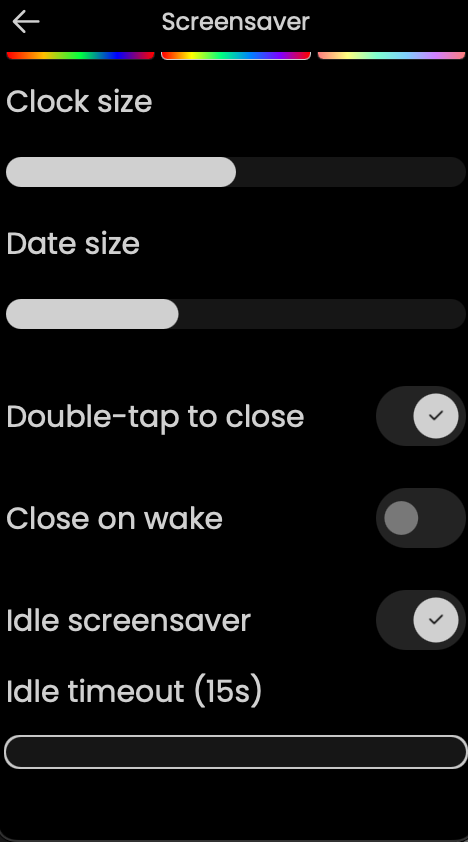
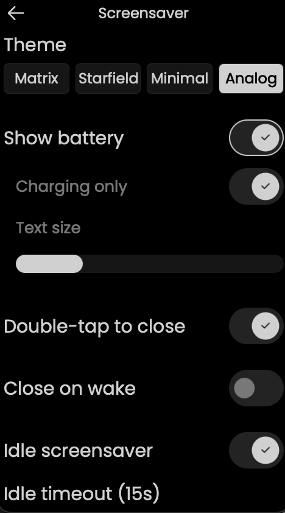

# Custom Screensaver for Unfolded Circle Remote 3

A fully configurable screensaver system for the UC Remote 3. **Five themes** — GPU-accelerated Matrix rain, Starfield warp, Minimal digital clock, Analog clock, and TV Static — all controllable from the remote's Settings menu, DPAD, touchbar, and touch gestures. Plus a shared **screen-off animation system** that plays a configurable shutdown effect right before the display blanks.

## Demo

[](https://youtube.com/shorts/jFoOmoNNWwU)

## Screenshots

### Themes

| Matrix Rain (Neon) | Matrix Rain (Green) | Starfield | Minimal Clock |
|:------------------:|:-------------------:|:---------:|:-------------:|
|  |  |  |  |

*(Screenshots for TV Static + Analog to be added.)*

### Settings — Matrix

| Theme & Overlays | Appearance | Direction & Effects |
|:----------------:|:----------:|:-------------------:|
|  |  |  |

| Glitch & Chaos | Tap Effects | Messages & Behavior |
|:--------------:|:-----------:|:-------------------:|
|  |  |  |

| DPAD & Touch |
|:------------:|
|  |

### Settings — Starfield

| Speed & Density | Star Size & Trail | Star Color |
|:---------------:|:-----------------:|:----------:|
|  |  |  |

### Settings — Minimal

| Font & Time Color | Date Color & Size | Clock & Date Size |
|:-----------------:|:-----------------:|:-----------------:|
|  |  |  |

### Settings — Analog

| Analog Settings |
|:---------------:|
|  |

## Features

### Themes

- **Matrix Rain** — GPU-accelerated falling character rain with full customization (see below)
- **Starfield** — animated star field with configurable speed, density, star size, trail length, and color (7 solid + 3 rainbow gradients). Touchbar adjusts density, swipe adjusts speed.
- **Minimal Clock** — clean digital clock with date, configurable font (Poppins / Space Mono), size, and independent time/date color pickers with rainbow gradient support (battery overlay optional)
- **Analog Clock** — UC's stock analog clock face with hour dots and second/minute/hour hands (battery overlay optional)
- **TV Static** — single-pass GPU fragment shader composing analog dead-channel snow, VHS chroma bleed, CRT scanlines, rolling vertical-hold tracking bar, and channel-flash bursts. Full visual and cadence control.

### Matrix Rain

**Appearance:**
- 9 color modes — Green, Blue, Red, Amber, White, Purple, Rainbow, Rainbow+, Neon
- 4 character sets — Katakana, ASCII, Binary, Digits
- Adjustable font size, animation speed, column density, trail length, trail fade
- Invert trail direction (bright tail instead of bright head)
- Head glow toggle
- Glow fade slider — controls how long residual glow persists (0 = none, 100 = maximum). Prevents screen fill-up in rainbow modes.

**Visual Effects:**
- **Rain layers** — 3 independent rain grids at different font sizes (far=small/slow, mid=normal, near=large/fast). Creates depth through physical size difference. Toggle in settings.
- **Color layers** — per-stream atmospheric color tinting via custom GPU shader (texture × per-vertex RGBA). Continuous gradient from dim teal (slow streams) to bright chartreuse (fast streams). Toggle + intensity slider + overlay mode.
- **Depth glow** — residual glow cells shrink with age, creating a depth illusion where fading characters appear to recede. Toggle + min size slider.

**Direction & Movement:**
- 8-way direction control (cardinal + diagonal) via settings, DPAD, or touch zones
- Auto-rotate — continuous 360-degree direction sweep with smooth curved trails
- Configurable rotation speed and trail bend (curve tightness)
- Per-stream lerp produces visible curves during direction changes
- Direction-agnostic grid — streams fill the screen evenly in any direction

**Glitch Effects (individually toggleable):**
- Character swap — trail characters randomly change
- Brightness flash — random cells spike to full brightness
- Column flash — entire columns flash bright
- Column stutter — stream heads pause briefly
- Reverse glow — dim cells briefly brighten
- Direction change — glitch trails shoot in configurable directions
- Adjustable glitch intensity

**Chaos Events:**
- Surge (full-screen flash)
- Scramble (character mutation wave)
- Freeze (all streams pause)
- Square burst (expanding square outline overlay)
- Ripple (expanding circular ring overlay)
- Screen wipe (brightness wave sweeps across screen)
- Scatter (burst of glitch trails from random points)
- Configurable frequency, intensity, and individual sub-type toggles
- Square burst has independent size slider

**Hidden Messages:**
- Configurable message text (comma-separated)
- 5 message directions — horizontal L/R, vertical T/B, stream-aligned
- Messages always read naturally regardless of rain direction (no mirroring)
- Surrounding flash and brightness pulse toggles
- Adjustable message interval and random ordering

**Subliminal Messages:**
- In-stream injection — single characters appear in active streams
- Overlay spanning — full message text positioned across the screen
- Flash mode — brief full-brightness reveal
- Configurable interval and duration

**Tap Interaction:**
- **Master "Enable tap effects" toggle** — single switch that disables every tap effect at once. When off, taps still wake/cancel screen-off animations but produce no visual effect on the rain. All sub-options collapse from the settings page so only the master toggle shows.
- Single tap — corruption burst at touch point with configurable effects:
  - Scatter burst (glitch trails explode from tap) — configurable count + length
  - Flash shockwave (nearby streams flash)
  - Character scramble (randomize cells around tap)
  - Stream spawn (new streams from tap point) — configurable count + length
  - Message injection (hidden message at tap point)
  - Square burst (expanding square outline overlay) — configurable size
  - Ripple (expanding circular ring overlay)
  - Screen wipe (brightness sweep from tap point)
- Randomize mode — each effect gets an independent coin flip per tap
- Double-tap to close screensaver (toggleable)

**Touch-Zone Directions (alternative to DPAD):**
- Screen split into 3×3 grid — tap a zone to change rain direction
- Center zone: tap 1-2 = glitch + effects, tap 3 = restore direction, tap 4 = close
- Edge zones: every tap fires direction + effects
- Mutually exclusive with DPAD interactive
- Remember direction toggle — persists last touch direction between sessions

**Swipe & Hold Gestures:**
- Swipe up/down — adjust rain speed when touch direction mode is on (toggleable)
- Hold — staged slowdown: 500ms = 3× slow, 1500ms = pause. Release resumes.

**DPAD Interaction:**
- Arrow keys change rain direction in real-time
- Volume/Channel buttons map to diagonal directions
- Enter: single tap = chaos burst, double-tap = restore direction, hold = slow motion
- DPAD interactive toggle (enable/disable all DPAD controls)
- Direction persistence — remembers last DPAD direction between sessions (toggleable)
- Touchbar speed — swipe the touchbar to adjust animation speed (toggleable, visible when DPAD is on)
- When DPAD interactive is OFF, all DPAD buttons dismiss the screensaver

### TV Static

**Visual composition (single GPU fragment-shader pass):**
- **Luma snow** — hash-based per-pixel grayscale noise. Adjustable intensity and *snow size* (1–8 px cells, quantized for that chunky "big pixel" analog feel)
- **VHS chroma bleed** — faint offset hash lookups in R and B channels produce the red/blue chroma ringing of an old VHS tape
- **CRT scanlines** — hard alternating rows with configurable strength and bi-directional roll speed (negative = up, 0 = static, positive = down)
- **Rolling tracking bar** — Gaussian soft band drifting vertically at configurable speed, like VHS vertical-hold drift
- **Channel-flash bursts** — bright white flash overlays. Fully configurable:
  - On-tap (tap anywhere = flash)
  - Auto cadence (jittered interval, 3–120 s with ±50 % randomness)
  - Flash duration (80–1000 ms)
  - Flash brightness (0–100 %)
- **Tint color** — 7 solid swatches (white, matrix green, neon blue, red, amber, purple, grey) tints the whole frame

### Overlays

- **Clock** — digital time display with configurable font, size, color (7 solid + 3 rainbow gradients), 24h/12h toggle, optional date line with **independent date color** (7 solid + 3 rainbow) and own size slider, "charging only" visibility
- **Battery** — color-coded by charge level (green → yellow → orange → red), shows "Fully charged" at 100%, configurable text size, "charging only" visibility option

### Screen-off Animations

A shared pre-display-off animation system. When the core decides it's time to dim and blank the display, a short animation plays right before the hardware powers off.

**How it's triggered:** event-driven via the core's `Normal → Idle` power-mode transition (the moment the display actually starts dimming). The system then measures the real duration of the dim phase on each cycle and times the animation so it ends exactly at `Idle → Low_power` (the hardware blank). No baseline drift, no guessing — dim-phase duration is self-calibrating across dock states and config changes. A 200 ms polling fallback remains in place in case the `Idle` signal is missed.

**Tier 1 — Shared overlay (any theme)**, 8 styles:

*Draw-over styles (no theme sampling — zero GPU overhead beyond the shader pass):*
- **Fade** — simple monotonic black ramp. Safe baseline.
- **Flash** — brief white pulse followed by cut to black. Classic "TV zap off".
- **Iris (vignette)** — circular black mask closes from edges to centre. Soft smoothstep edge. (Uses a small inline GLSL shader for the radial mask.)
- **Wipe** — black rectangle sweeps top-to-bottom like an old film projector.
- **Wave** — soft cyan gradient wave travels from top to bottom, dimming everything behind it.

*Theme-sampling styles (distort the underlying theme's rendering via a captured-texture shader):*
- **Genie** — theme content shrinks and slides toward the bottom of the screen via an inverse-scale UV transform. Uniform-shrink, not a fluid mesh-warp ribbon (Qt 5.15 limitation: fragment-shader-only), but visually "zoom to corner". Outside the shrinking rectangle masks to black.
- **Pixels** — theme progressively pixelates into bigger and bigger blocks (0.5% → 8% of screen width), then the pixelated output fades to black.
- **Dissolve** — theme blends into per-pixel white noise, progressively shifting to pure noise, then the noise fades to black.

The sampling-based styles use a single `ShaderEffectSource` to capture the active theme into an offscreen FBO so the overlay shaders can sample it. The FBO is only allocated when one of the sampling styles is actually playing — non-sampling styles and the theme-native mode keep zero GPU cost.

**Tier 2 — Theme-native animations**: themes can opt in with their own tightly-integrated shutdown effect via an optional protocol (`providesNativeScreenOff`, `screenOffLeadMs`, `startScreenOff() / cancelScreenOff() / finalizeScreenOff()`). Currently **TV Static** uses this for a classic **CRT collapse** — the snow and scanlines collapse vertically into a bright horizontal line, then the line shrinks horizontally to a single dot, then the dot fades to black. 800 ms collapse + 500 ms black hold so it finishes synchronized with the real hardware display-off.

All other themes (Matrix, Starfield, Analog, Minimal) use the Tier 1 shared overlay exclusively. Matrix briefly had a native cascade prototype in earlier builds; it was rolled back in v1.2.1 because the running-binding pause/resume race on wake left the rain area black across multiple cycles. The shared styles are architecturally simpler, work reliably on every theme, and don't fight Qt's scene graph lifecycle.

**Controls:** `Settings → Power saving → Screen off animations`:
- **Enabled** — master on/off (default on)
- **Fire when undocked** — also plays on battery idle-timeout (default off). Turning this on also auto-cascades so the screensaver actually opens on battery (you don't need a separate toggle).
- **Style picker** — Fade / Flash / Iris / Wipe / Theme. "Theme" defers to the theme's native implementation if it has one, otherwise falls back to fade.

### General Behavior

- **Double-tap to close** — dismiss screensaver with a screen double-tap (touch-zone mode: 4-tap center)
- **Close on wake** — automatically close when picking up the remote
- **Any physical button dismisses** — all remote buttons close the screensaver unconditionally
- **Idle screensaver** — activate screensaver after configurable idle timeout (15-55s) when undocked
- **Display power gating** — animation pauses when display is off, resumes on wake
- **Touchbar isolation** — volume, seek, brightness, and position sliders are suppressed while the screensaver is active. Touchbar is used for screensaver controls (Matrix: speed, Starfield: density).

## Settings Reference

All settings are in **Settings > Screensaver** on the remote.

| Section | Settings | Themes |
|---------|----------|--------|
| Theme | Matrix / Starfield / Minimal / Analog / TV Static | All |
| Overlays | Show clock (+ charging only, font, color, size, 24h, show date + date size + **date color (7 solid + 3 rainbow)**, position: top/center/bottom), Show battery (+ charging only, text size) | Matrix/Starfield/TV Static |
| Overlays | Show battery (+ charging only, text size) | Minimal/Analog |
| Appearance | Color, Characters, Font size, Speed, Density, Trail, Fade | Matrix |
| Direction | Auto-rotate, Rotation speed, Trail bend, Direction picker | Matrix |
| Visual | Invert trail, Head glow, Glow fade, Depth glow (+ min size), Rain layers, Color layers (+ intensity + overlay) | Matrix |
| Glitch | Master toggle, Intensity, Column flash/stutter, Reverse glow | Matrix |
| Direction Glitch | Toggle, Frequency, Length, 8 direction toggles, Fade, Speed, Random color | Matrix |
| Chaos | Toggle, Frequency, Intensity, Surge/Scramble/Freeze/Square burst (+ size)/Ripple/Wipe/Scatter (+ freq + length) | Matrix |
| Tap Effects | Burst (+ count + length), Flash, Scramble, Spawn (+ count + length), Message, Square burst (+ size), Ripple, Wipe, Randomize + chance | Matrix |
| Subliminal | Toggle, Stream/Overlay/Flash modes, Interval, Duration | Matrix |
| Messages | Text input, Interval, Random order, Direction, Flash, Pulse | Matrix |
| Starfield | Animation speed, Star density, Star size, Trail length, Star color (7 solid + 3 rainbow) | Starfield |
| Minimal | 24-hour clock, Font (Poppins / Space Mono), Time color (7 solid + 3 rainbow), Date color (7 solid + 3 rainbow), Clock size, Date size | Minimal |
| TV Static | Snow intensity, Snow size (1–8 px), Scanline strength, Scanline roll speed, Chroma bleed, Rolling tracking bar (+ speed), Tint color, Channel flash (on-tap + auto bursts + interval + duration + brightness) | TV Static |
| Screen off animations | Enabled, Fire when undocked, Style (Fade / Flash / Iris / Wipe / Wave / Genie / Pixels / Dissolve / Theme-native) | All (lives under **Power saving**, not Screensaver) |
| Behavior | Double-tap to close, Close on wake, Idle screensaver, Idle timeout | All |
| Interaction | DPAD interactive (+ remember direction + touchbar speed), Touch directions (+ remember direction + swipe speed) | Matrix |

## Installation

### Requirements

- Unfolded Circle Remote 3 (firmware >= 1.9.0)
- Docker (for cross-compilation)

### Build & Deploy

```bash
# Cross-compile for ARM64
cd "/path/to/UC-Remote-UI"
docker run --rm --user=$(id -u):$(id -g) -v "$(pwd)":/sources \
    unfoldedcircle/r2-toolchain-qt-5.15.8-static:latest

# Package and install
cp binaries/linux-arm64/release/remote-ui deploy/bin/
cd deploy && tar -czf ../matrix-charging-screen.tar.gz release.json bin/ config/
curl --location "http://<remote-ip>/api/system/install/ui?void_warranty=yes" \
    --form "file=@../matrix-charging-screen.tar.gz" \
    -u "web-configurator:<pin>" --max-time 120
```

The UI restarts automatically after installation.

### Desktop Preview (macOS)

```bash
# Build natively (requires Homebrew Qt 5.15)
qmake && make -j$(sysctl -n hw.ncpu)

# Run with dev model flag
UC_MODEL=DEV "./binaries/osx-x86_64/release/Remote UI.app/Contents/MacOS/Remote UI"
```

### Revert to Stock

```bash
curl -X PUT "http://<remote-ip>/api/system/install/ui?enable=false" \
    -u "web-configurator:<pin>"
```

## Technical Details

- **Matrix renderer:** C++ QQuickItem with custom `MatrixRainShader` (texture × per-vertex RGBA) — single GPU draw call per frame
- **TV Static renderer:** Qt 5.15 `ShaderEffect` with inline GLSL ES 2.0 fragment shader. All six visual layers (snow, chroma, scanlines, tracking bar, intensity, channel flash) composed in a single full-frame pass. Pure QML — no C++ additions.
- **Screen-off animation system:** two-tier architecture in `ChargingScreen.qml`. **Tier 1** shared `ScreenOffOverlay.qml` draws one of N styles above the active theme via a single `progress: 0..1` property. **Tier 2** optional theme-native protocol (`providesNativeScreenOff`, `screenOffLeadMs`, `startScreenOff/cancelScreenOff/finalizeScreenOff`) lets themes take over rendering entirely. Trigger is event-driven via `Power.powerModeChanged` on `Normal → Idle` with empirical dim-phase measurement (self-calibrating, zero baseline math). 200 ms wall-clock poller as fallback.
- **Simulation (Matrix):** Pure C++ (no Qt object system) — deterministic, cache-friendly
- **Config bridge:** ScreensaverConfig C++ singleton — owns its own QSettings instance (zero custom lines in upstream config.h), SCRN_* macros for single-declaration properties
- **GradientText:** Reusable QML component for solid or rainbow gradient text via QtGraphicalEffects LinearGradient (zero GPU overhead when solid)
- **Atlas caching:** Static in-memory cache of the combined multi-layer glyph atlas (~3.7 MB). Survives dock/undock cycles (process stays alive, only QML is recreated). First dock builds the atlas (~8s on ARM64); repeat docks skip rasterization entirely (~5s — remaining time is QML lifecycle). Cache key: SHA-1 of color, colorMode, fontSize, charset, fadeRate, depthEnabled. Invalidates automatically on settings change.
- **Tests:** 133 total (92 C++ unit + 41 QML integration), CI green
- **Display power gating:** Zero CPU/GPU when screen is off
- **Font:** Bundled 23KB Noto Sans Mono CJK JP subset (katakana + digits)

For architecture details, see [SCREENSAVER-IMPLEMENTATION.md](SCREENSAVER-IMPLEMENTATION.md).
For build instructions, see [BUILD.md](BUILD.md).

## Release History

**v1.2.1** (2026-04-13) — drop displayOff gate from running binding (fixes wake-black)
- **Fixed** rain going black on wake from any screen-off animation cycle. Root cause was a `running: visible && !isClosing && !displayOff` binding race: on wake, `setRunning(false) → setRunning(true)` fired in the same QML tick as `cancelScreenOffEffect` and `setSpeed`, and Qt does not guarantee binding / notifier / onChanged ordering. The race left the scene graph's first post-wake `updatePaintNode()` submitting an empty geometry node. Fix: drop `!displayOff` from the binding — the sim ticks through display-off (near-zero cost because Qt stops compositing when the display is off).
- **Removed** Matrix theme-native cascade animation. Matrix now falls through to the shared `ScreenOffOverlay` styles (fade / pixelate / dissolve / genie / etc.) same as Starfield and Minimal.
- **Removed** the Matrix shutdown animation settings section.
- **Fixed** `holdPauseTimer` was writing `matrixRain.running = false` imperatively from QML, permanently breaking the running binding on the theme instance. Replaced with new `Q_INVOKABLE pauseTicks()` / `resumeTicks()` C++ methods that stop and start the tick timer without breaking the binding.
- **Fixed** `postAnimationSafetyTimer` was closing the popup when the core's `Low_power` transition didn't fire within `leadMs + 1500ms`. On undocked setups where `Low_power` never fires, this was dumping the user to the home screen on every wake. Changed to set `displayOff = true` instead — popup stays alive.

**v1.2.0** (2026-04-13) — runtime slider wiring + tap master toggle
- **Fixed** the Matrix animation speed, density, trail length, fade, and color sliders silently having no effect on the live rain. Root cause was a signal-to-signal `connect` in `ScreensaverConfig`'s ctor that didn't route through correctly because the raw `matrix*Changed` signals were declared via macro while the transformed `*Changed` signals were declared in a separate manual `signals:` block — Qt's MOC + QML binding engine don't trace indirect signal chains. Fixed with the canonical Qt dual-emit pattern: hand-written setters emit both the raw and the transformed NOTIFY signal directly.
- **Added** master "Enable tap effects" toggle in the Tap section of the Charging Screen settings.
- **Bumped** `TICK_MAX_MS` from 150 to 300 so slider value 10 actually maps to a visibly slower tick.

See [SCREENSAVER-IMPLEMENTATION.md](SCREENSAVER-IMPLEMENTATION.md) for detailed session logs.

## Roadmap

- ✅ **TV Static** — analog snow / VHS chroma / CRT scanlines / rolling tracking bar / channel-flash bursts (shipped 2026-04-10)
- ✅ **Screen-off animation system** — shared Fade / Flash / Iris / Wipe / Wave / Genie / Pixels / Dissolve + theme-native protocol with TV Static CRT collapse (shipped 2026-04-10)
- ✅ **v1.2.1 wake-black fix** — dropped the `displayOff` gate from the theme `running` binding. Matrix + Starfield sims now keep ticking through display-off, eliminating the QML binding / scene-graph race that left the rain area black on wake (shipped 2026-04-13)
- **Screen-off animations Batch 3** — additional shared overlay styles under consideration (Venetian blinds, Radial sweep, Barn doors, CRT degauss flash)
- ~~**Per-theme native screen-off animations**~~ — the native cascade was attempted for Matrix and rolled back in v1.2.1 because any theme that pauses its internal tick on display-off triggers a QML binding race with the scene graph on wake. Future theme-native effects should either use the TV Static model (C++ shader-driven, no ticking simulation underneath) or be implemented as pure visual overlays that do NOT mutate the underlying sim state.

## How This Was Built

This project was vibecoded — designed, implemented, and iterated entirely through conversation with [Claude Code](https://claude.ai/claude-code) (Anthropic's CLI agent). The C++ renderers, QML settings UI, GPU shader pipeline, config bridge architecture, test suite, CI workflow, and this README were all produced through iterative human-AI collaboration. No line was copy-pasted from a tutorial or LLM playground; every commit went through the same review loop: describe intent, generate code, test on device, refine.

The human side: architecture decisions, visual taste, UC3 hardware testing, and "that doesn't look right" feedback. The AI side: C++17/Qt 5.15 implementation, QSG scene graph plumbing, test generation, and debugging CI failures at 3am.

## License

GPL-3.0-or-later. Fork of [unfoldedcircle/remote-ui](https://github.com/unfoldedcircle/remote-ui).
