# Custom Screensaver for Unfolded Circle Remote 3

A fully configurable screensaver system replacing the UC Remote 3's stock analog clock. GPU-accelerated Matrix rain, Starfield, and Minimal clock themes — all controllable from the remote's Settings menu and DPAD.

## Screenshots

### Themes

| Matrix Rain (Neon) | Matrix Rain (Green) | Starfield | Minimal Clock |
|:------------------:|:-------------------:|:---------:|:-------------:|
| 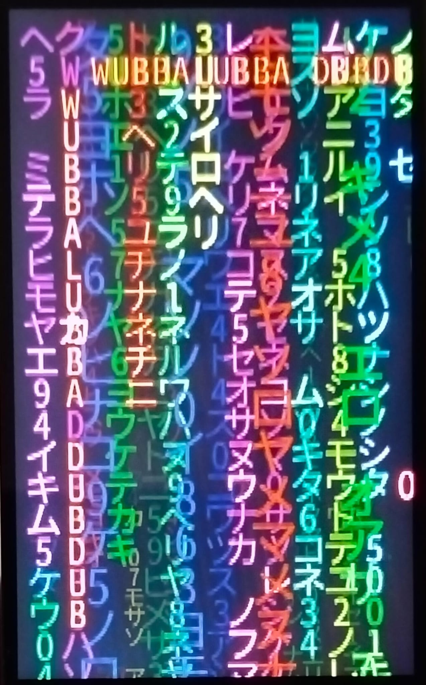 | 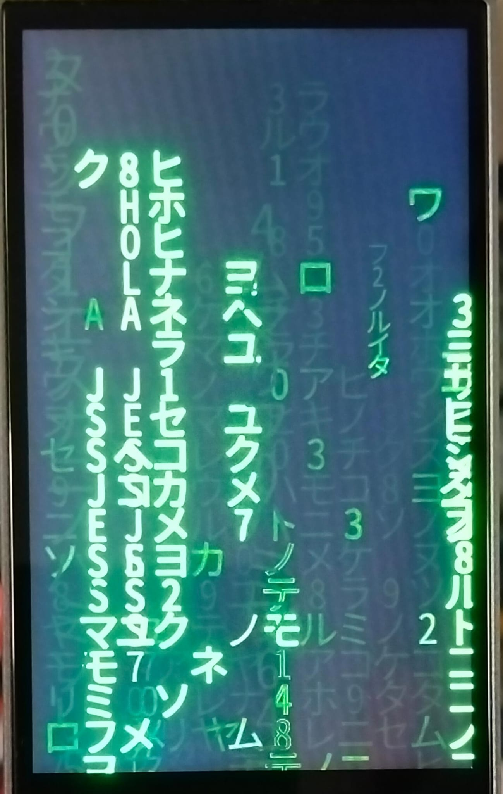 |  |  |

### Settings

| Theme & Overlays | Appearance | Direction & Visual |
|:----------------:|:----------:|:------------------:|
| 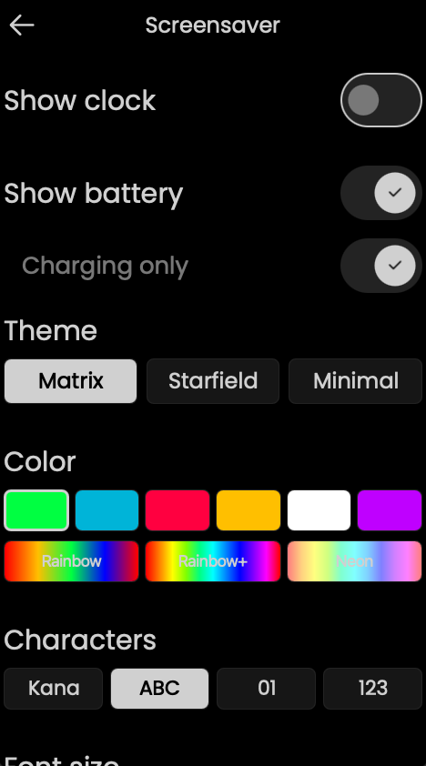 | 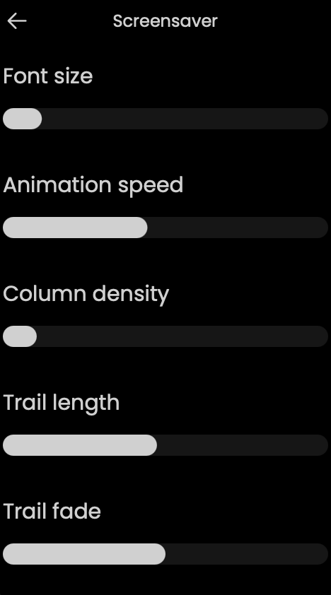 | 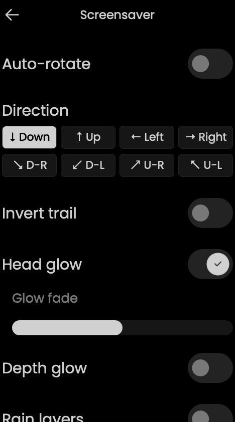 |

| Glitch Effects | Direction Glitch | Chaos & Tap |
|:--------------:|:----------------:|:-----------:|
| 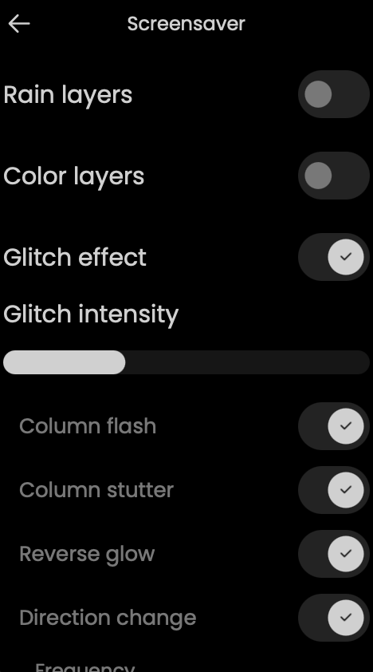 | 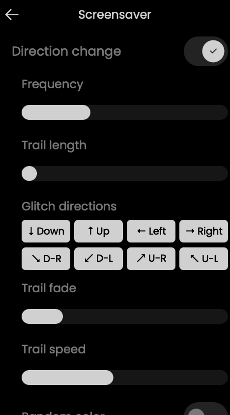 | 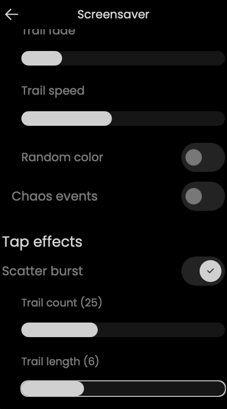 |

| Tap Effects | Messages & Behavior | DPAD & Touch |
|:-----------:|:-------------------:|:------------:|
| 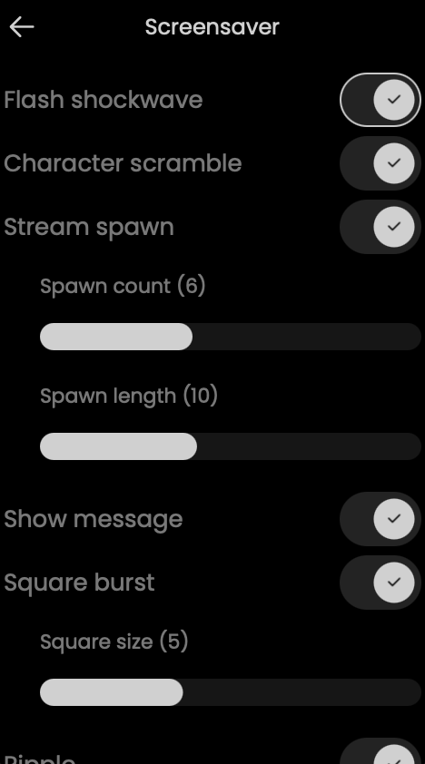 | 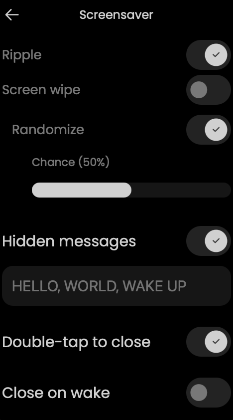 | 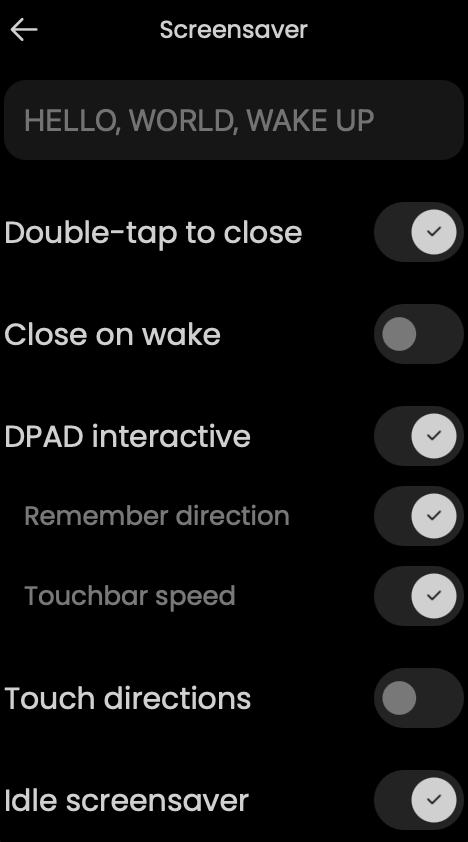 |

| Starfield Settings | Minimal Settings | Minimal Settings (cont.) |
|:------------------:|:----------------:|:------------------------:|
| 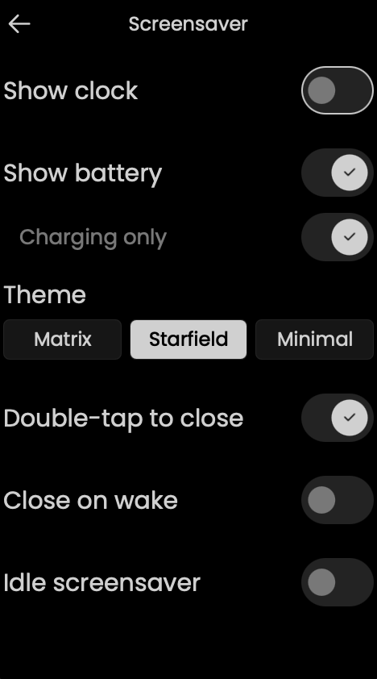 | 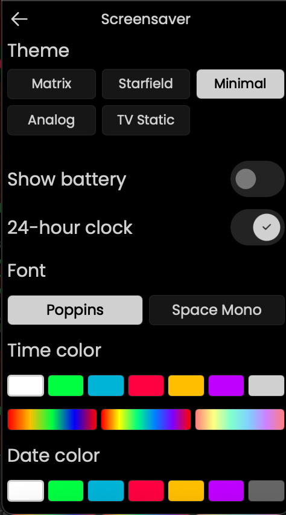 | 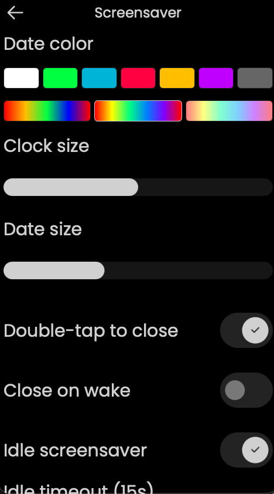 |

## Features

### Themes

- **Matrix Rain** — GPU-accelerated falling character rain with full customization (see below)
- **Starfield** — animated star field with configurable speed and density
- **Minimal Clock** — clean digital clock with date, configurable font (Poppins / Space Mono), size, and independent time/date color pickers with rainbow gradient support (battery overlay optional)
- **Analog Clock** — UC's stock analog clock face with hour dots and second/minute/hour hands (battery overlay optional)

### Matrix Rain

**Appearance:**
- 9 color modes — Green, Blue, Red, Amber, White, Purple, Rainbow, Rainbow+, Neon
- 4 character sets — Katakana, ASCII, Binary, Digits
- Adjustable font size, animation speed, column density, trail length, trail fade
- Invert trail direction (bright tail instead of bright head)
- Head glow toggle
- Glow fade slider — controls how long residual glow persists (0 = none, 100 = maximum). Prevents screen fill-up in rainbow modes.

**Visual Effects:**
- **Rain layers** — 3 independent rain grids at different font sizes (far=small/slow, mid=normal, near=large/fast). Creates depth through physical size difference. Toggle in settings.
- **Color layers** — per-stream atmospheric color tinting via custom GPU shader (texture × per-vertex RGBA). Continuous gradient from dim teal (slow streams) to bright chartreuse (fast streams). Toggle + intensity slider + overlay mode.
- **Depth glow** — residual glow cells shrink with age, creating a depth illusion where fading characters appear to recede. Toggle + min size slider.

**Direction & Movement:**
- 8-way direction control (cardinal + diagonal) via settings, DPAD, or touch zones
- Auto-rotate — continuous 360-degree direction sweep with smooth curved trails
- Configurable rotation speed and trail bend (curve tightness)
- Per-stream lerp produces visible curves during direction changes
- Direction-agnostic grid — streams fill the screen evenly in any direction

**Glitch Effects (individually toggleable):**
- Character swap — trail characters randomly change
- Brightness flash — random cells spike to full brightness
- Column flash — entire columns flash bright
- Column stutter — stream heads pause briefly
- Reverse glow — dim cells briefly brighten
- Direction change — glitch trails shoot in configurable directions
- Adjustable glitch intensity

**Chaos Events:**
- Surge (full-screen flash)
- Scramble (character mutation wave)
- Freeze (all streams pause)
- Square burst (expanding square outline overlay)
- Ripple (expanding circular ring overlay)
- Screen wipe (brightness wave sweeps across screen)
- Scatter (burst of glitch trails from random points)
- Configurable frequency, intensity, and individual sub-type toggles
- Square burst has independent size slider

**Hidden Messages:**
- Configurable message text (comma-separated)
- 5 message directions — horizontal L/R, vertical T/B, stream-aligned
- Messages always read naturally regardless of rain direction (no mirroring)
- Surrounding flash and brightness pulse toggles
- Adjustable message interval and random ordering

**Subliminal Messages:**
- In-stream injection — single characters appear in active streams
- Overlay spanning — full message text positioned across the screen
- Flash mode — brief full-brightness reveal
- Configurable interval and duration

**Tap Interaction:**
- Single tap — corruption burst at touch point with configurable effects:
  - Scatter burst (glitch trails explode from tap) — configurable count + length
  - Flash shockwave (nearby streams flash)
  - Character scramble (randomize cells around tap)
  - Stream spawn (new streams from tap point) — configurable count + length
  - Message injection (hidden message at tap point)
  - Square burst (expanding square outline overlay) — configurable size
  - Ripple (expanding circular ring overlay)
  - Screen wipe (brightness sweep from tap point)
- Randomize mode — each effect gets an independent coin flip per tap
- Double-tap to close screensaver (toggleable)

**Touch-Zone Directions (alternative to DPAD):**
- Screen split into 3×3 grid — tap a zone to change rain direction
- Center zone: tap 1-2 = glitch + effects, tap 3 = restore direction, tap 4 = close
- Edge zones: every tap fires direction + effects
- Mutually exclusive with DPAD interactive
- Remember direction toggle — persists last touch direction between sessions

**Swipe & Hold Gestures:**
- Swipe up/down — adjust rain speed when touch direction mode is on (toggleable)
- Hold — staged slowdown: 500ms = 3× slow, 1500ms = pause. Release resumes.

**DPAD Interaction:**
- Arrow keys change rain direction in real-time
- Volume/Channel buttons map to diagonal directions
- Enter: single tap = chaos burst, double-tap = restore direction, hold = slow motion
- DPAD interactive toggle (enable/disable all DPAD controls)
- Direction persistence — remembers last DPAD direction between sessions (toggleable)
- Touchbar speed — swipe the touchbar to adjust animation speed (toggleable, visible when DPAD is on)
- When DPAD interactive is OFF, all DPAD buttons dismiss the screensaver

### Overlays

- **Clock** — digital time display with configurable font, size, color (7 solid + 3 rainbow gradients), 24h/12h toggle, optional date line with own size slider, "charging only" visibility
- **Battery** — color-coded by charge level (green → yellow → orange → red), shows "Fully charged" at 100%, configurable text size, "charging only" visibility option

### General Behavior

- **Double-tap to close** — dismiss screensaver with a screen double-tap (touch-zone mode: 4-tap center)
- **Close on wake** — automatically close when picking up the remote
- **Any physical button dismisses** — all remote buttons close the screensaver unconditionally
- **Idle screensaver** — activate screensaver after configurable idle timeout (15-55s) when undocked
- **Display power gating** — animation pauses when display is off, resumes on wake

## Settings Reference

All settings are in **Settings > Screensaver** on the remote.

| Section | Settings | Themes |
|---------|----------|--------|
| Theme | Matrix / Starfield / Minimal | All |
| Overlays | Show clock (+ charging only, font, color, size, 24h, show date + date size), Show battery (+ charging only) | Matrix/Starfield |
| Overlays | Show battery (+ charging only, text size) | Minimal/Analog |
| Appearance | Color, Characters, Font size, Speed, Density, Trail, Fade | Matrix |
| Direction | Auto-rotate, Rotation speed, Trail bend, Direction picker | Matrix |
| Visual | Invert trail, Head glow, Glow fade, Depth glow (+ min size), Rain layers, Color layers (+ intensity + overlay) | Matrix |
| Glitch | Master toggle, Intensity, Column flash/stutter, Reverse glow | Matrix |
| Direction Glitch | Toggle, Frequency, Length, 8 direction toggles, Fade, Speed, Random color | Matrix |
| Chaos | Toggle, Frequency, Intensity, Surge/Scramble/Freeze/Square burst (+ size)/Ripple/Wipe/Scatter (+ freq + length) | Matrix |
| Tap Effects | Burst (+ count + length), Flash, Scramble, Spawn (+ count + length), Message, Square burst (+ size), Ripple, Wipe, Randomize + chance | Matrix |
| Subliminal | Toggle, Stream/Overlay/Flash modes, Interval, Duration | Matrix |
| Messages | Text input, Interval, Random order, Direction, Flash, Pulse | Matrix |
| Starfield | Animation speed, Star density | Starfield |
| Minimal | Font (Poppins / Space Mono), Clock size, Date size | Minimal |
| Behavior | Double-tap to close, Close on wake, Idle screensaver, Idle timeout | All |
| Interaction | DPAD interactive (+ remember direction + touchbar speed), Touch directions (+ remember direction + swipe speed) | Matrix |

## Installation

### Requirements

- Unfolded Circle Remote 3 (firmware >= 1.9.0)
- Docker (for cross-compilation)

### Build & Deploy

```bash
# Cross-compile for ARM64
cd "/path/to/UC-Remote-UI"
docker run --rm --user=$(id -u):$(id -g) -v "$(pwd)":/sources \
    unfoldedcircle/r2-toolchain-qt-5.15.8-static:latest

# Package and install
cp binaries/linux-arm64/release/remote-ui deploy/bin/
cd deploy && tar -czf ../matrix-charging-screen.tar.gz release.json bin/ config/
curl --location "http://<remote-ip>/api/system/install/ui?void_warranty=yes" \
    --form "file=@../matrix-charging-screen.tar.gz" \
    -u "web-configurator:<pin>" --max-time 120
```

The UI restarts automatically after installation.

### Desktop Preview (macOS)

```bash
# Build natively (requires Homebrew Qt 5.15)
qmake && make -j$(sysctl -n hw.ncpu)

# Run with dev model flag
UC_MODEL=DEV "./binaries/osx-x86_64/release/Remote UI.app/Contents/MacOS/Remote UI"
```

### Revert to Stock

```bash
curl -X PUT "http://<remote-ip>/api/system/install/ui?enable=false" \
    -u "web-configurator:<pin>"
```

## Technical Details

- **Renderer:** C++ QQuickItem with custom `MatrixRainShader` (texture × per-vertex RGBA) — single GPU draw call per frame
- **Simulation:** Pure C++ (no Qt object system) — deterministic, cache-friendly
- **Config bridge:** ScreensaverConfig C++ singleton — owns its own QSettings instance (zero custom lines in upstream config.h), SCRN_* macros for single-declaration properties
- **GradientText:** Reusable QML component for solid or rainbow gradient text via QtGraphicalEffects LinearGradient (zero GPU overhead when solid)
- **Atlas caching:** Static in-memory cache of the combined multi-layer glyph atlas (~3.7 MB). Survives dock/undock cycles (process stays alive, only QML is recreated). First dock builds the atlas (~8s on ARM64); repeat docks skip rasterization entirely (~5s — remaining time is QML lifecycle). Cache key: SHA-1 of color, colorMode, fontSize, charset, fadeRate, depthEnabled. Invalidates automatically on settings change.
- **Tests:** 133 total (92 C++ unit + 41 QML integration), CI green
- **Display power gating:** Zero CPU/GPU when screen is off
- **Font:** Bundled 23KB Noto Sans Mono CJK JP subset (katakana + digits)

For architecture details, see [SCREENSAVER-IMPLEMENTATION.md](SCREENSAVER-IMPLEMENTATION.md).
For build instructions, see [BUILD.md](BUILD.md).

## Roadmap

- **TV Static** — analog snow / static noise theme (planned)

## How This Was Built

This project was vibecoded — designed, implemented, and iterated entirely through conversation with [Claude Code](https://claude.ai/claude-code) (Anthropic's CLI agent). The C++ renderers, QML settings UI, GPU shader pipeline, config bridge architecture, test suite, CI workflow, and this README were all produced through iterative human-AI collaboration. No line was copy-pasted from a tutorial or LLM playground; every commit went through the same review loop: describe intent, generate code, test on device, refine.

The human side: architecture decisions, visual taste, UC3 hardware testing, and "that doesn't look right" feedback. The AI side: C++17/Qt 5.15 implementation, QSG scene graph plumbing, test generation, and debugging CI failures at 3am.

## License

GPL-3.0-or-later. Fork of [unfoldedcircle/remote-ui](https://github.com/unfoldedcircle/remote-ui).
